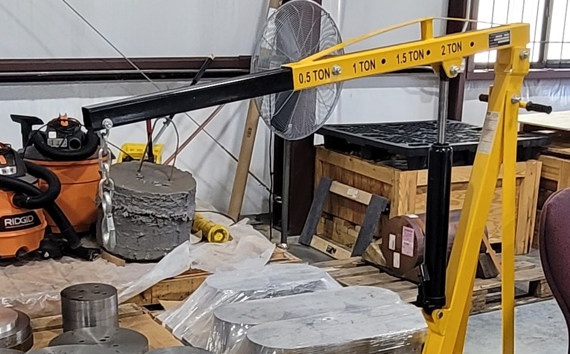

# Context-Rich Solid Mechanics Problem

## Adjustable Shop Crane Boom - Bending of a Telescoping Extension

### Engineering Context

An adjustable shop crane transfers a suspended load through its hook and telescoping extension into the main boom, mast-support system, base, and floor. The complete boom is supported by a pivot and hydraulic ram and is **not** modeled as a cantilever here. Only the effective projecting part of the telescoping extension beyond its support/retention section is isolated as a local cantilever beam.

{fig-alt="Yellow adjustable shop crane with telescoping boom, capacity markings, hook, mast, and hydraulic support." width=92%}

*Professor-supplied context photograph. Do not identify an exact crane model or infer dimensions from it.*

### Main Engineering Goal

Determine the maximum bending moment and maximum normal bending stress in the idealized local telescoping projection, then explain how increased reach affects bending demand and allowable lifted load.

### Analysis Scope

Use static beam equilibrium, a downward concentrated free-end load, and a straight prismatic rectangular hollow section. Exclude complete-frame analysis, mast buckling, pin/bolt and weld stresses, hydraulic-cylinder analysis, tipping, fatigue, deflection, yielding or factor of safety, FEA, impact, swing, vibration, and lifting dynamics.
