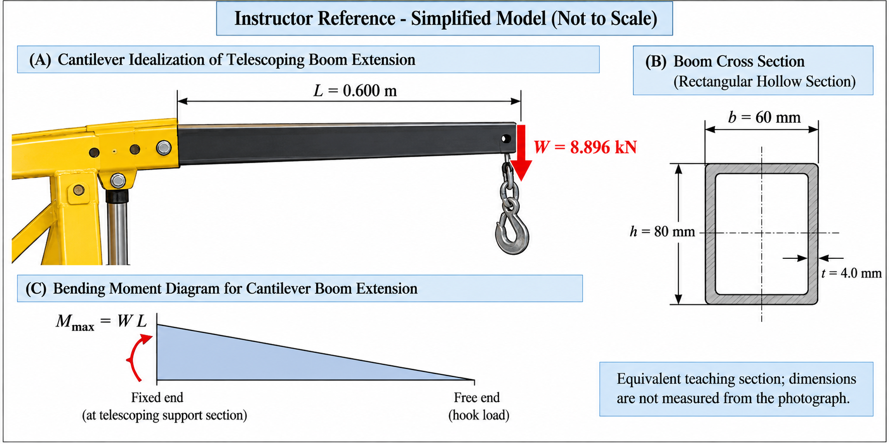

# Purpose

Award credit for distinguishing the local projection from the complete crane boom, tracing the real load path, constructing the local cantilever model, calculating shear and moment, evaluating the rectangular hollow section, applying the flexure formula, and stating a bounded reach-capacity interpretation.

# Problem Context



# Instructor Reference Idealization

{fig-alt="Instructor-only local cantilever and cross-section reference." width=96%}

# Generated Question Set and Solutions

```{=html}
<div id="adjustable-shop-crane-boom-bending-instructor-questions"></div>
<script src="../../data/problem-catalog.js"></script><script src="../../scripts/packet-renderer.js"></script>
<script>document.addEventListener("DOMContentLoaded",()=>window.renderProblemPacket({slug:"adjustable-shop-crane-boom-bending",targetId:"adjustable-shop-crane-boom-bending-instructor-questions",type:"instructor"}));</script>
```

# Sources and Provenance

The 8.896 kN hook load is the nominal teaching load corresponding approximately to 2000 lbf. The effective local length and equivalent section dimensions are instructor-assigned and are not measured from the photograph.

ATD Tools' ATD-10141B product information and ATD-10141 family manual document commercial engine cranes with discrete reach/capacity positions and identify typical boom, extension, support, hydraulic, upright, and hook components. Those publications provide contextual evidence only and do not identify the photographed crane or supply this problem's geometry: <https://www.atdtools.com/10141> and <https://atdtools.com/PDF/ATD10141_rev_0417.pdf>.

# Scope

Neglect extension self-weight, adjustment-hole and weld stresses, pin stresses, mast and frame behavior, hydraulic-ram force, base stability, material allowables, deflection, three-dimensional effects, impact, swing, fatigue, vibration, and lifting dynamics. Reserve mast buckling and connection mechanics for separate problems.
