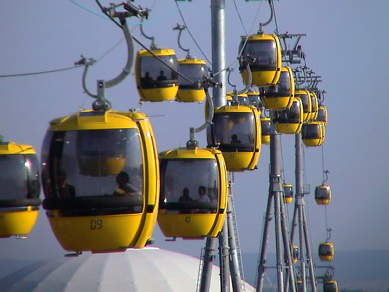

# Context-Rich Solid Mechanics Problem

## Structural Stress Evaluation of an Aerial Gondola Suspension Hanger

### Engineering Context

Aerial gondola cabins are suspended from an overhead cable carriage through a structural hanger. The hanger must transfer the weight of the cabin and passengers to the carriage while providing sufficient clearance between the cabin roof, cable, grip mechanism, and carriage hardware. For this reason, the hanger is often shaped or offset rather than being a single straight member.

The offset is useful for packaging and clearance, but it introduces an important structural tradeoff. A portion of the hanger that lies directly on the load line carries mainly axial tension, while a portion located away from that load line carries the same tensile force through an eccentric path. That eccentricity creates an additional bending moment and can greatly increase the tensile stress at one side of the cross-section.

For this MEEN 305 analysis, the hanger is idealized as a pin-connected offset member with a uniform square cross-section. The engineering objective is to compare the normal stress in an aligned region with the normal stress in an offset region and determine how strongly the hanger geometry influences the maximum tensile demand.

{fig-alt="Passenger gondolas traveling on an aerial ropeway and suspended below the cable by shaped hangers." width=88%}

### Main Engineering Goal

Determine the largest tensile normal stress in the aligned and offset hanger regions, identify the governing region and mechanical cause, and recommend one geometry change that would reduce the governing stress.

### System Components

- passenger gondola cabin;
- suspension hanger;
- cabin attachment;
- overhead carriage / trolley; and
- cable system.
