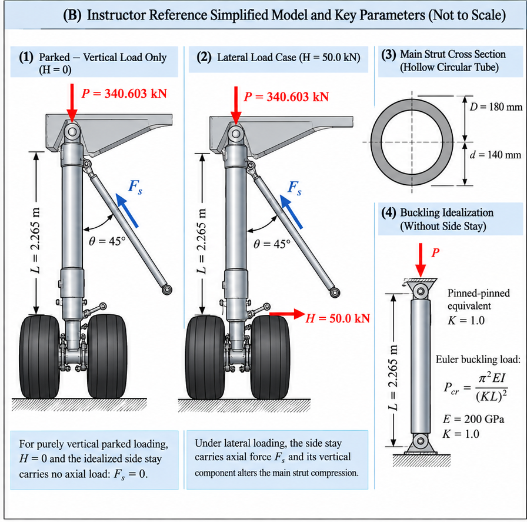

# Purpose

Award credit for a defensible landing-gear load path, correct pin-jointed two-force-member equilibrium, explicit lateral-load direction, consistent section properties and units, correct Euler buckling calculations, and conclusions bounded to the assigned teaching idealization.

# Problem Context



# Instructor Reference Idealization

{fig-alt="Instructor-only reference idealization for landing-gear side-stay equilibrium and main-strut buckling." width=92%}

The rightward lateral-load arrow is essential: for the direction shown, the side stay is in tension and its upward vertical component reduces main-strut compression. Reversing the lateral load reverses the side-stay force and increases main-strut compression.

# Generated Question Set and Solutions

```{=html}
<div id="aircraft-main-landing-gear-buckling-side-stay-instructor-questions"></div>
<script src="../../data/problem-catalog.js"></script>
<script src="../../scripts/packet-renderer.js"></script>
<script>
document.addEventListener("DOMContentLoaded", () => {
  window.renderProblemPacket({
    slug: "aircraft-main-landing-gear-buckling-side-stay",
    targetId: "aircraft-main-landing-gear-buckling-side-stay-instructor-questions",
    type: "instructor"
  });
});
</script>
```

# Source and Input Distinctions

The 34,720 kg-equivalent maximum static main-gear ground load per strut is based on published Airbus A320-200 W000 airport-planning data and is converted using fixed <em>g</em> = 9.81 m/s<sup>2</sup>. The 2.265 m representative compressed main-gear dimension is reported in published landing-gear literature and is used only as the equivalent column length.

The equivalent outer and inner diameters, elastic modulus, effective-length factor, side-stay angle, and lateral load are instructor-assigned teaching inputs. They are not measured or proprietary Airbus structural data, and the 50.0 kN lateral load is not an Airbus certification load.

# Sources and Provenance

1. Airbus, *Aircraft Characteristics - Airport and Maintenance Planning, A320*. The A320-200 W000 pavement-load table reports the maximum static vertical main-gear ground load per strut as 34,720 kg-equivalent: <https://aircraft.airbus.com/sites/g/files/jlcbta126/files/2023-02/Airbus-techdata-AC_A320_0322.pdf>.
2. The completed faculty template identifies published landing-gear literature reporting a 2265 mm compressed A320 main-gear dimension. This value is used only as the representative equivalent column length; the template does not treat it as a complete strut geometry specification.
3. EASA AD 2016-0018R1 identifies A320-family main-landing-gear side-stay assemblies and attachment structure, supporting the real-system component terminology.
4. Hibbeler, *Mechanics of Materials*, supplies the standard hollow-section and Euler-column relations used in this MEEN 305 teaching model.

# Scope of the Base Problem

Neglect joint eccentricity, local bending, non-prismatic geometry, actual joint rotational stiffness, shock-strut and tire compliance, side-stay/lock-stay mechanism detail, impact, dynamics, fatigue, vibration, yielding, local connector stresses, actuator loads, FEA, three-dimensional effects, and certification load cases. The idealized parked result <em>F</em><sub>s</sub> = 0 does not imply that a real parked-aircraft side stay is necessarily unstressed.
