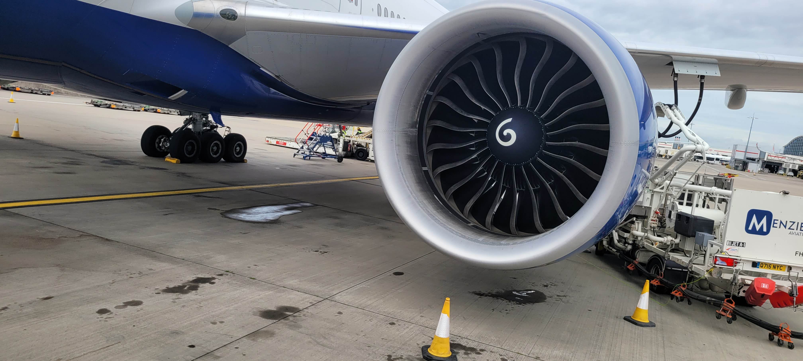

# Context-Rich Solid Mechanics Problem

## Aircraft Wing with Engine - Combined Bending and Torsion

### Engineering Context

A large under-wing turbofan engine applies its weight to the wing through the pylon. For this Strength of Materials analysis, one wing is idealized as a tapered cantilever wing box fixed at the fuselage. The engine/pylon assembly is represented by a concentrated mass at its center of mass. Its spanwise distance from the root produces bending, and its chordwise eccentricity from the idealized wing-box shear/reference axis produces torsion.

The photograph motivates the physical system only. Do not identify the aircraft model or infer analytical geometry from the image. The engine mass is source-backed; the wing-box geometry, engine location, eccentricity, and equivalent wall thickness are instructor-assigned teaching values.

{fig-alt="Large turbofan engine suspended beneath an aircraft wing on an airport apron." width=92%}

*Industry-context photograph supplied by the instructor/user. It is not a dimensional reference.*

### Main Engineering Goal

Determine the bending moment and torque generated by the engine weight, evaluate bending normal stress and thin-walled closed-section torsional shear stress at the root and at the mid-inboard section, and explain how taper changes the two stress responses.

### Analysis Scope

Use only the static engine-weight contribution. Exclude aerodynamic lift, fuel and wing self-weight, thrust, maneuver/gust and dynamic loads, fatigue, buckling, local pylon or connector stresses, stress concentrations, multicell geometry, composite anisotropy, FEA, failure criteria, and certification-level analysis.
