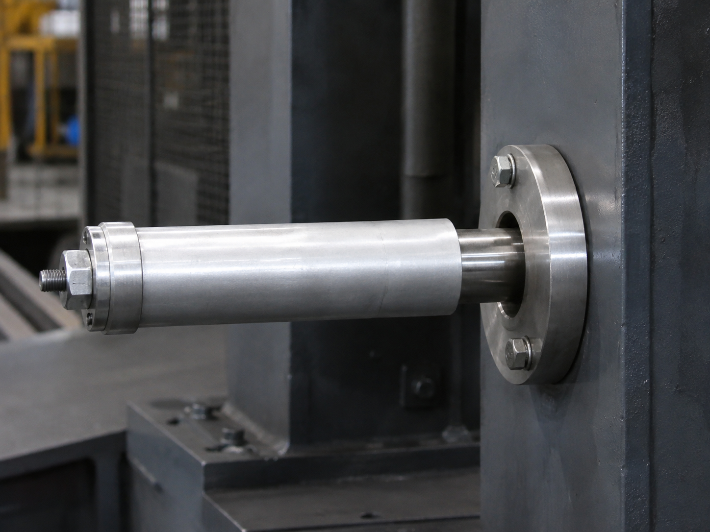

# Context-Rich Solid Mechanics Problem

## Axial Displacement of a Steel Tie Rod and Aluminum Spacer Tube Assembly

### Engineering Context

A mechanical engineering team is evaluating a compact tie-rod assembly used in a machine-frame or actuator support system. A steel rod passes through an aluminum spacer tube. A rigid collar attached to the rod bears against the left end of the tube, while the right end of the tube reacts against a fixed support plate.

When a tensile load is applied to the exposed end of the steel rod, the rod elongates and the aluminum tube shortens. The free rod end positions or preloads a connected component, so its net displacement relative to the fixed support must be determined.

{fig-alt="Industrial steel tie rod and aluminum spacer tube assembly mounted at a machine-frame support." width=100%}

### Main Engineering Goal

Determine the displacement of free end C relative to fixed support A by accounting for both the elongation of the steel rod and the shortening of the aluminum tube.

### System Components

- aluminum spacer tube AB;
- steel tie rod BC;
- rigid collar at B;
- fixed support plate at A;
- loaded rod end C.
