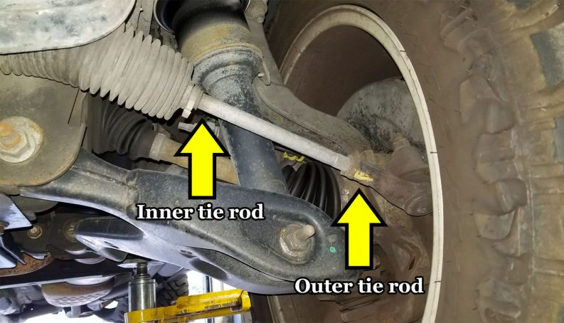

# Context-Rich Solid Mechanics Problem

## Axial Displacement of a Steel Tie-Rod and Aluminum Tube Assembly

### Engineering Context

Tie-rod assemblies are widely used in mechanical systems to transfer axial force while controlling the relative position of connected parts. Familiar applications include vehicle steering linkages, machine frames, actuator supports, clamping assemblies, and structural fixtures. The industrial image provides a real example of a tie-rod assembly; the mechanics model used in this problem isolates the axial load-transfer behavior needed for a Solid Mechanics analysis.

In the assembly considered for analysis, a steel tie rod passes through an aluminum spacer tube. A rigid collar attached to the rod bears against one end of the tube, while the opposite end of the tube bears against a rigid support. When the exposed end of the rod is pulled, the steel rod elongates and the aluminum tube shortens. The final movement of the loaded end therefore depends on the deformation of both members rather than on the elongation of the steel rod alone.

{fig-alt="Vehicle steering linkage showing inner and outer tie rods." width=100%}

### Main Engineering Goal

Determine the displacement of the loaded end of the tie rod relative to the fixed supporting structure by accounting for both the elongation of the steel rod and the shortening of the aluminum tube.

### System Components

- steel tie rod;
- aluminum spacer tube;
- rigid collar;
- support plate.
