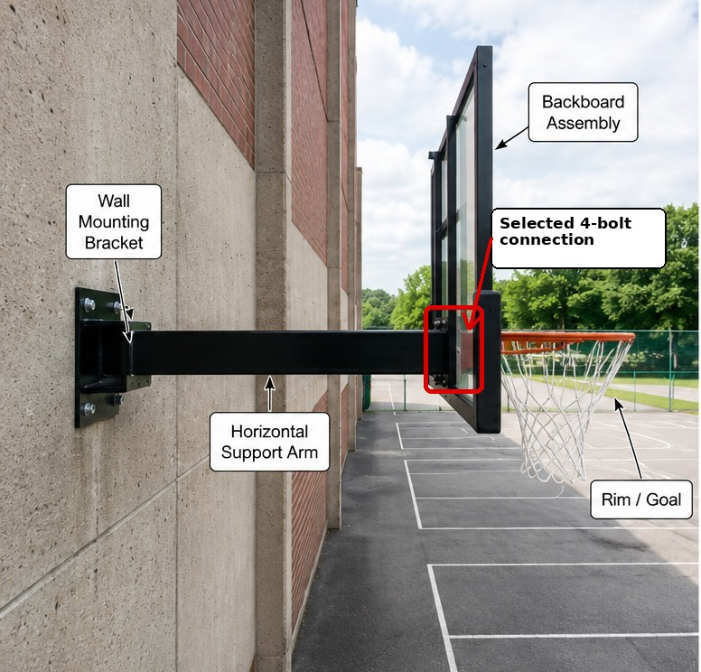

# Context-Rich Solid Mechanics Problem

## Direct-Shear Safety Check of Basketball-Hoop Mounting Bolts During a Dunk

### Engineering Context

During a forceful dunk, load applied at the rim passes through the backboard and frame into the horizontal support structure. In this problem, you are part of a design team reviewing the selected four-bolt joint between the backboard mounting plate and the support-arm bracket.

The assigned connection shear is based on a simplified player-impact estimate. For a representative 95 kg player descending 0.10 m before the rim is fully loaded, the speed is about 1.40 m/s. With an effective stopping distance of 0.060 m and a triangular approximation for the dynamic portion of the pulse, the estimated peak force is about 4.04 kN; the baseline problem uses a rounded 4.0 kN load.

{fig-alt="Wall-mounted basketball hoop, backboard, rim, support arm, wall bracket, and highlighted four-bolt connection." width=88%}

### Main Engineering Goal

Determine whether the proposed bolts provide the required factor of safety against bolt shear yielding. Also determine the minimum nominal bolt diameter and the allowable total connection shear for the simplified direct-shear model.

### System Components

- backboard and rim assembly that receives the applied dunk load;
- mounting plate and support-arm bracket joined at the selected connection;
- identical mounting bolts that transfer the connection shear; and
- horizontal support arm that carries load toward the wall mounting system.

### Scope of the Model

Treat the assigned load as an equivalent static vertical connection shear. Assume identical bolts, equal direct-shear sharing, rigid connected plates, and smooth bolt shanks at the shear plane. Idealize the mounting bolts as loose, clearance-fit connectors: the connected brackets bear against the bolt shanks, transferring the assigned transverse load directly to the bolts in shear. Frictional load transfer from bolt clamping or preload is neglected. The model excludes eccentric bolt-group moment, bolt tension, bearing failure, tear-out, prying, thread effects, fatigue, and local deformation.
