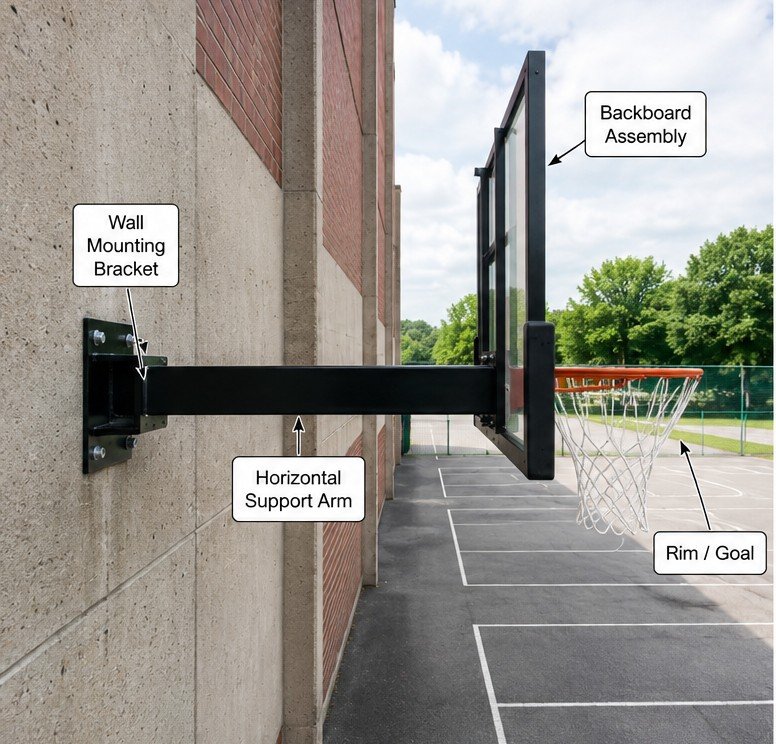

# Context-Rich Solid Mechanics Problem

## Bending and Deflection of a Basketball Hoop Support Arm During a LeBron James Dunk

### Engineering Context

Wall-mounted basketball goals use a horizontal structural arm to position the backboard and rim away from the supporting wall. During a forceful dunk, load from the rim passes through the backboard/frame assembly into the horizontal arm and then into the wall-mounted bracket. The arm must remain sufficiently strong and stiff under this transferred demand.

The actual short-duration interaction is not derived from player mass, velocity, impact duration, or rim compliance. Instead, the transferred demand is represented by an instructor-specified equivalent downward design load at the end of the support arm. This keeps the analysis focused on undergraduate beam equilibrium, stress, and deflection methods.

{fig-alt="Side view of a wall-mounted basketball goal showing the wall mounting bracket, horizontal support arm, backboard assembly, and rim." width=88%}

### Main Engineering Goal

Determine whether the idealized support arm satisfies both the required first-yield bending factor of safety and the allowable free-end deflection. If either criterion is not met, determine a practical section-height modification and state a limitation of the model.

### System Components

- wall/building structure providing the final restraint;
- wall mounting bracket transferring arm loads into the wall;
- horizontal support arm evaluated as the primary deformable member;
- backboard/frame assembly transferring the rim load to the arm; and
- rim/goal where the use load originates.
