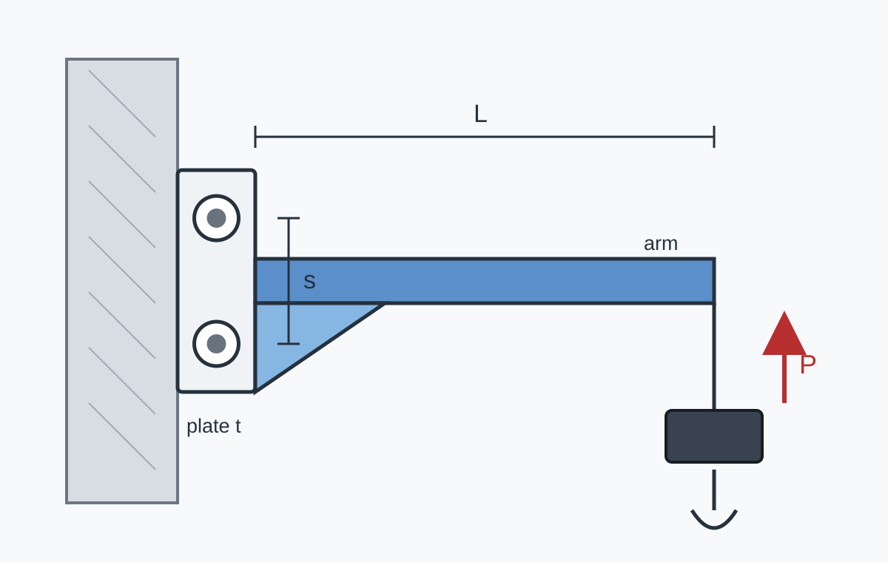

# Purpose

This package is included to test the modular problem-builder workflow. The default problem data, variables, and selectable instructor answers are stored in the same folder as the problem image.

# Instructor Builder

Use the [Instructor Builder](../../instructor-builder.qmd) to select this problem, edit variables, choose questions, and export student homework or instructor answer documents.

{fig-alt="A bolted wall bracket supporting a lift arm with a suspended load at the end." width=100%}
