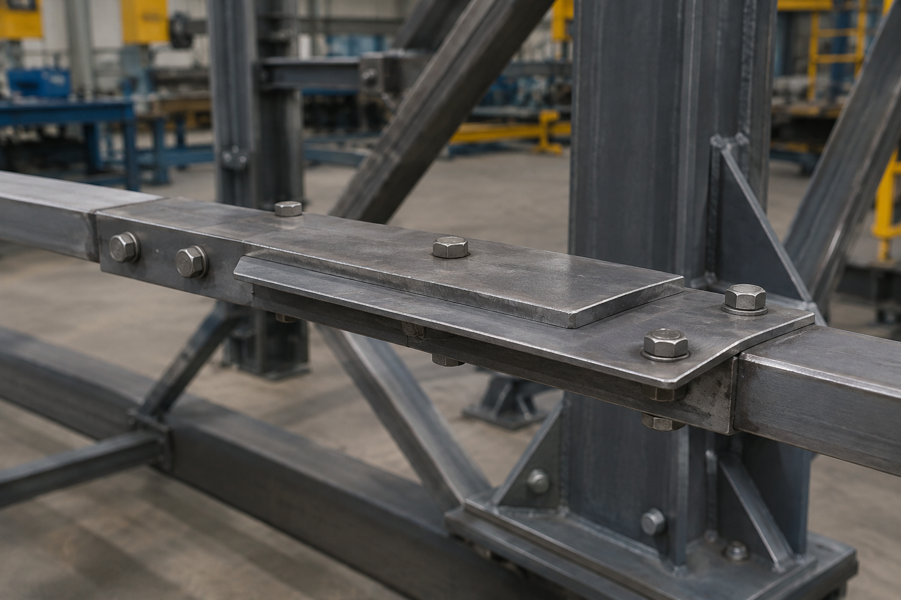

# Context-Rich Solid Mechanics Problem

## Bonded A992 Steel Plate Splice Joint

### Engineering Context

A structural equipment manufacturer is evaluating a bonded plate-splice connection used to transfer axial load between two portions of a steel machine frame. One primary plate overlaps upper and lower reinforcement plates. Continuous bonded seams transfer load from the incoming plate into the two outgoing plates.

Relative displacement across the splice must remain small enough to preserve alignment of nearby equipment. An initial Mechanics of Materials model retains the changing number of load-carrying plates while excluding detailed local behavior at the ends of the bonded seams.

{fig-alt="Overlapping steel splice plates in an industrial structural frame." width=88%}

The field image motivates the overlapping splice geometry. The assigned analytical model replaces the visible discrete fasteners with the continuous bonded seams shown in the instructor reference idealization.

### Main Engineering Goal

Determine the axial displacement of end A relative to end B by dividing the joint into constant-area regions, evaluating the internal axial force and stiffness of each region, and summing the corresponding axial deformations.

### System Components

- primary A992 steel plate;
- upper and lower splice plates;
- continuous bonded overlap interfaces;
- axial end loads at A and B;
- three regions with different effective cross-sectional areas.
