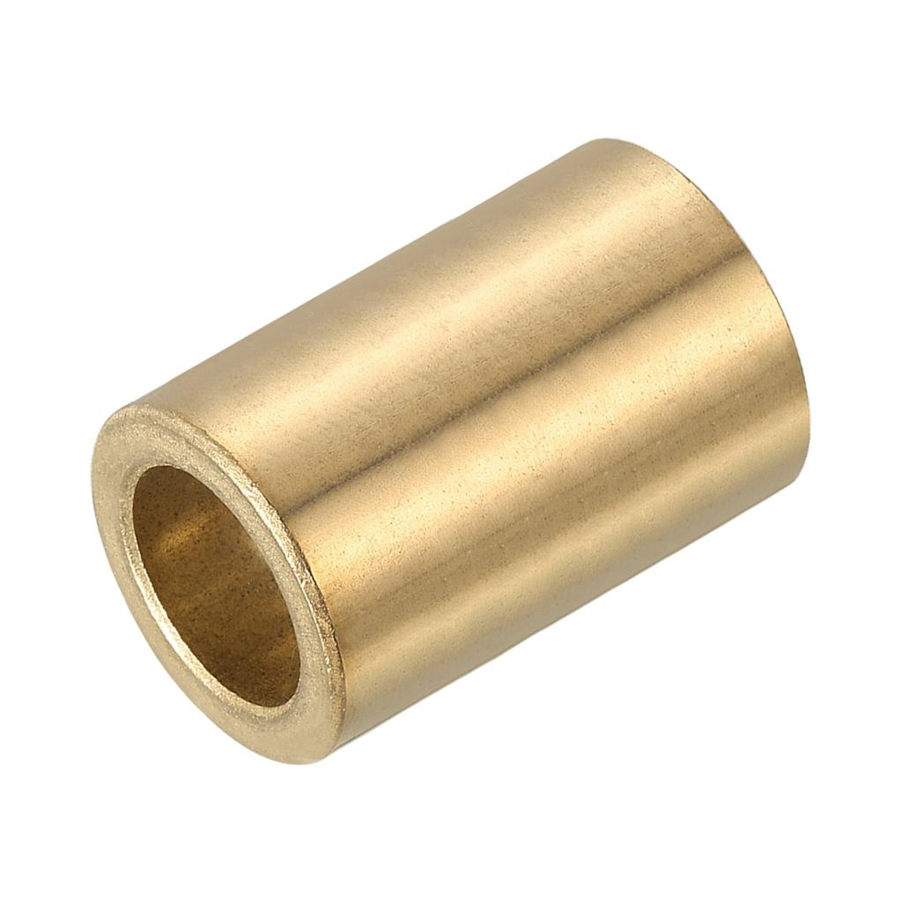

# Context-Rich Solid Mechanics Problem

## Brass Sleeve Bushing – Thermal Contraction for Interference-Fit Installation

### Engineering Context

A maintenance engineer must install a replacement brass sleeve bushing into an existing steel housing. At room temperature, the bushing outside diameter is intentionally slightly larger than the housing bore, creating an interference fit after assembly. For installation, the bushing is cooled so thermal contraction temporarily reduces its outside diameter enough to provide a small assembly clearance. The steel housing remains at room temperature.

{fig-alt="Temporary representative commercial brass sleeve bushing on a white background." width=68%}

::: {.callout-warning title="Temporary development image"}
Reuse permission/licensing for this representative commercial image has not been verified. Replace it with an appropriately licensed image before public/final release. Do not infer problem dimensions or material condition from the pictured product.
:::

### Main Engineering Goal

Determine how cold the brass bushing must be before installation so that it fits into the steel housing bore with the specified temporary diametral clearance. Interpret the signed thermal deformation and assess the simplified model's scope.

### System Components

- brass sleeve bushing;
- steel housing;
- cylindrical housing bore.

### Analysis Scope

Treat the bushing outside diameter as a linear dimension undergoing uniform thermal deformation. The housing remains at the initial room temperature, so its bore diameter is unchanged. Contact pressure and stresses after the bushing warms are outside this problem.
