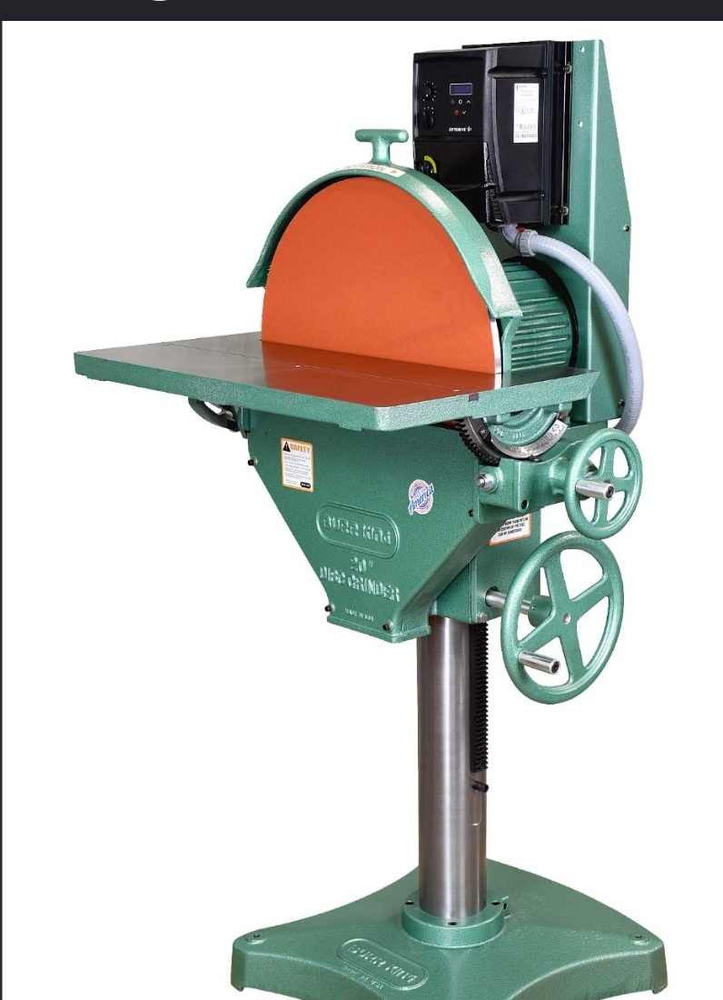

# Context-Rich Solid Mechanics Problem

## Burr King Disc Grinder Shaft - Combined Bending, Torsion, and Deflection

### Engineering Context

A manufacturing engineer is evaluating the horizontal spindle that supports and drives the abrasive disc. The spindle transmits motor torque while an equivalent transverse grinding force bends the locally overhung shaft segment. Excessive deflection can affect alignment and surface quality even when stresses are modest.

{fig-alt="Industrial pedestal-mounted Burr King disc grinder with a large abrasive disc, motor, table, frame, and adjustment wheels." width=58%}

*Professor-supplied context image. Do not infer shaft dimensions, bearing spacing, overhang, grinding force, or an exact internal spindle geometry from it.*

### Main Engineering Goal

Model only the local overhung spindle segment as an equivalent solid circular cantilever. Determine torque from the assigned power and speed, calculate the base bending moment, size the idealized shaft to satisfy the assigned transverse-deflection criterion, and evaluate bending, torsional, and von Mises stresses at that stiffness-sized diameter.

### Analysis Scope

The real bearing-supported spindle is not claimed to be a literal bare cantilever. Use the instructor-assigned local equivalent support plane, force, overhang, modulus, and serviceability criterion. Exclude fatigue, stress concentrations, keyways, shoulders, bearing design and life, critical speed, vibration, imbalance, thermal effects, detailed contact mechanics, frame deformation, FEA, manufacturer certification, and unsupported strength or factor-of-safety claims.
