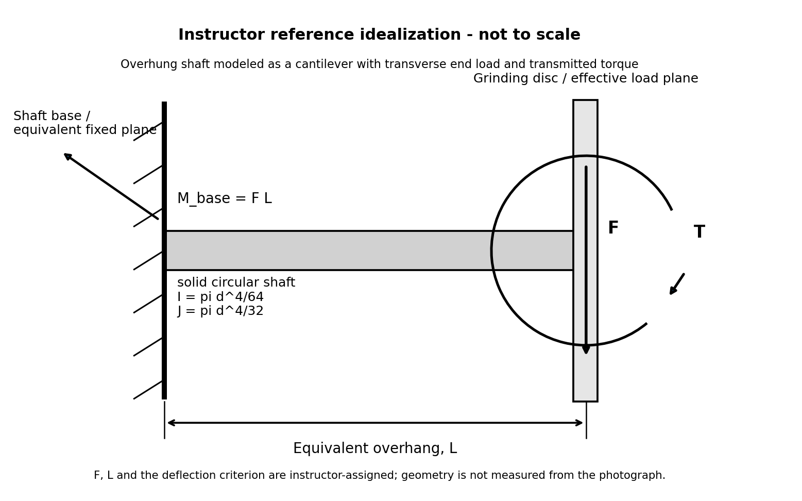

# Purpose

Award credit for tracing torque and transverse-force load paths, constructing the local overhung-shaft model, sizing the shaft from the assigned deflection criterion, evaluating bending and torsional stresses, combining them with von Mises, and interpreting sensitivities without claiming an actual Burr King shaft specification or certification.

# Problem Context



# Instructor Reference Idealization

{fig-alt="Instructor-only local overhung-shaft cantilever idealization." width=96%}

# Generated Question Set and Solutions

```{=html}
<div id="burr-king-grinder-instructor-questions"></div>
<script src="../../data/problem-catalog.js"></script><script src="../../scripts/packet-renderer.js"></script>
<script>document.addEventListener("DOMContentLoaded",()=>window.renderProblemPacket({slug:"burr-king-disc-grinder-shaft",targetId:"burr-king-grinder-instructor-questions",type:"instructor"}));</script>
```

# Sources and Provenance

Burr King Model 20 documentation provides the 3 hp context. The baseline 1725 rpm value is the faculty-selected operating speed near the documented maximum. F = 150 N, L = 100 mm, E = 200 GPa, and delta_allow = 5 micrometers are instructor-assigned teaching inputs. The photograph supplies context only; no geometry is measured from it. The deflection criterion is not claimed to be a Burr King manufacturer limit.

# Scope

The real spindle is bearing-supported and is not asserted to be a literal bare cantilever. The calculation is a local equivalent teaching model. It excludes actual internal geometry and bearing spacing, stepped features, shoulders, keyways, stress concentrations, bearing reactions/compliance and life, fatigue, critical speed, vibration, imbalance, gyroscopic and thermal effects, contact mechanics, manufacturing tolerances, frame deformation, FEA, and certification. No yield strength or material factor of safety is introduced.
