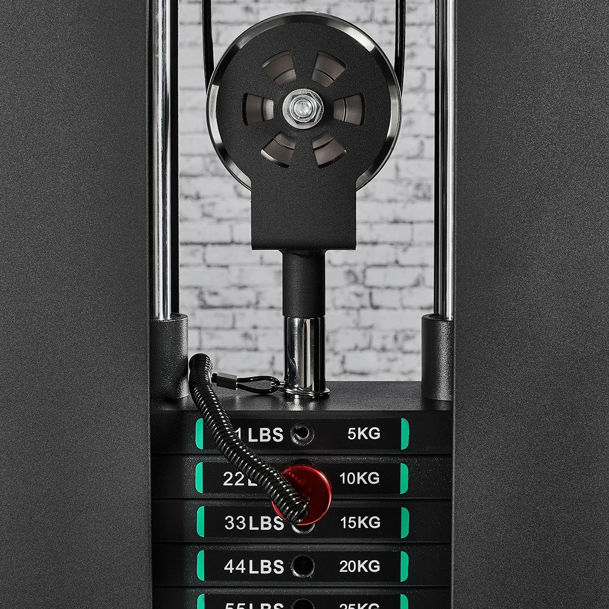

# Context-Rich Solid Mechanics Problem

## Cable Machine Pulley Axle - Dead, Live, and Accidental Loading

### Engineering Context

A selectorized cable machine uses an adjustable pulley to redirect cable tension. The analyzed axle transfers the resultant pulley load into two supporting bracket plates and then into the carriage and frame.

{fig-alt="Cable-machine adjustable pulley mounted above a selectorized weight stack." width=82%}

*Temporary development image for visual context only. Do not infer any numerical input, dimension, material property, cable ratio, capacity, or cable angle from the photograph. Replace it with an author-owned, open-license, or otherwise publication-approved image before public release.*

### Main Engineering Goal

Compare average axle double-shear demand under pulley dead load, normal full-stack live load, and a simplified accidental/transient load. Identify the governing case without claiming that the real connection is safe.

### Analysis Scope

Treat the included angle between the two equal cable-tension vectors as theta. Use an ideal pulley, the assigned ideal cable ratio, a circular axle in average double shear, two equally sharing bracket plates, and static-equivalent loading. Keep gravitational acceleration fixed at 9.81 m/s^2. Exclude axle material strength, factor of safety, bearing stress, axle bending, local thread or retaining-feature stresses, bracket deformation, fatigue, impact history, clearances, stress concentrations, and complete-machine validation.
