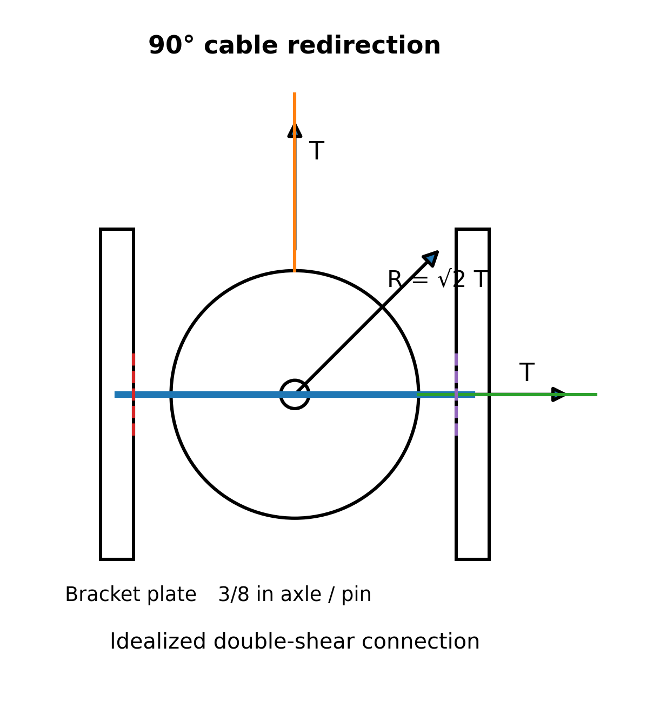

# Purpose

Award credit for distinguishing physical dead, live, and accidental loading; tracing the weight-stack-to-frame load path; resolving two equal cable tensions at a general included angle; calculating average axle double-shear stresses; identifying the governing case; and bounding the conclusion appropriately.

# Problem Context



# Instructor Reference Idealization

{fig-alt="Instructor-only pulley free-body and double-shear axle model with two bracket plates." width=78%}

The two cable tensions act on the pulley. Their resultant is balanced by the axle/bracket reaction, and the force transmitted from pulley to axle is equal and opposite. The stress calculation uses the transmitted-force magnitude, so the force-arrow sign convention does not change the reported average shear-stress magnitude.

# Generated Question Set and Solutions

```{=html}
<div id="cable-machine-pulley-axle-shear-instructor-questions"></div>
<script src="../../data/problem-catalog.js"></script><script src="../../scripts/packet-renderer.js"></script>
<script>document.addEventListener("DOMContentLoaded",()=>window.renderProblemPacket({slug:"cable-machine-pulley-axle-shear",targetId:"cable-machine-pulley-axle-shear-instructor-questions",type:"instructor"}));</script>
```

# Sources and Value Provenance

- The ATX Cable Pull Tower CPT-800 manufacturer page supports the 90 kg selectorized stack and 2:1 pulley ratio: <https://www.atxfitness.com/atx-cable-pull-tower-cpt-800>.
- A documented commercial 3.5-inch gym pulley supplies the 0.41 lb (0.186 kg) mass and 3/8-inch bore basis: <https://tkstar.com/products/3-1-2x-3-8-bore-pulley-for-lifefitness-home-or-commercial-gym>.
- Independent gym-equipment bracket evidence supports a 3/8-inch mounting-hole basis: <https://www.exercise-equipment-parts.com/weld-on-pulley-bracket.html?viewfullsite=1>.
- ISO 20957-2 provides the documented loading-framework basis for the assigned 1.5 coefficient. Here it is only a simplified transient multiplier, not a complete certification load: <https://www.iso.org/standard/83392.html>.
- The 90-degree baseline angle is an instructor-selected configuration, and g = 9.81 m/s^2 is a physical constant. No numerical value is inferred from the photograph. The temporary industry image requires publication clearance or replacement before public release.

# Scope and Model Limitations

No axle material or allowable strength is assigned, so no factor of safety or claim of actual safety is made. A production assessment would also require material and condition, bearing, axle bending, pulley/bracket spacing, thread and retaining-feature stresses, bracket deformation, fatigue, impact history, clearances, stress concentrations, and full load-path verification.
