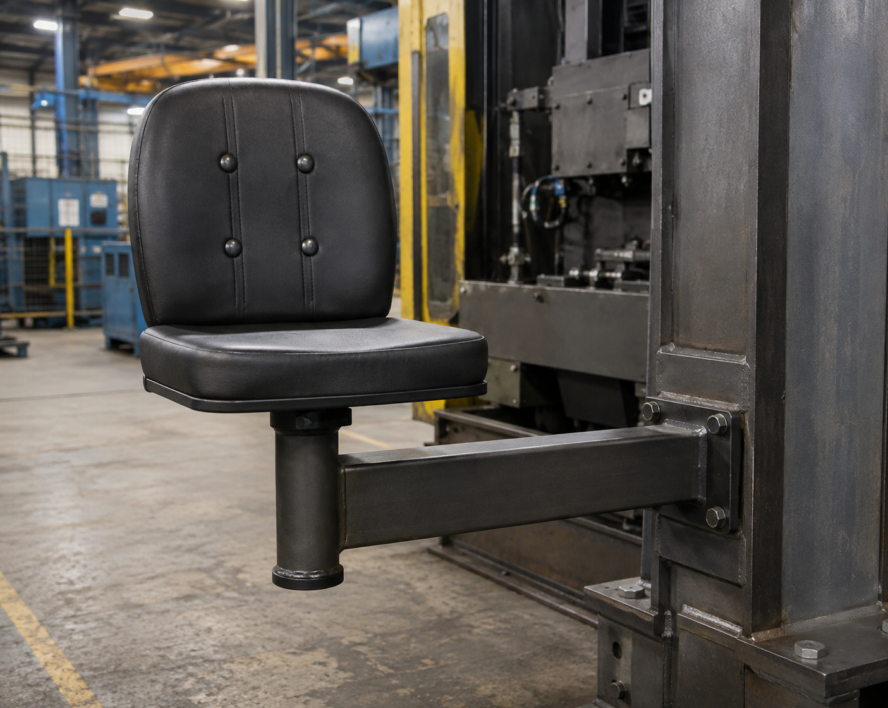

# Context-Rich Solid Mechanics Problem

## Bending Stress in a Cantilevered Industrial Operator-Seat Support

### Engineering Context

Industrial machines sometimes use side-mounted operator seats so that the floor area beneath the seat remains clear for access, tooling, material movement, or machine components. The seat is supported from the machine frame by a projecting structural arm, so the weight of the operator acts at a horizontal offset from the machine structure and creates bending in the arm.

Hollow rectangular tubing is a practical choice for this type of support because it places material away from the neutral axis, providing good bending stiffness and strength without the mass of a solid section. The bending demand increases as the seat is moved farther from the machine frame, while the tube geometry controls how effectively the arm resists that bending.

For this MEEN 305 analysis, the seat support is treated as a cantilevered beam under a static occupant load. The engineering objective is to determine the bending stress in the hollow tube and identify how the seat offset and cross-sectional geometry influence the structural demand.

{fig-alt="Side-mounted industrial operator seat supported by a cantilever arm attached to a machine frame." width=88%}

### Main Engineering Goal

Determine the maximum normal bending stress in the hollow rectangular support arm, identify the extreme fibers where the largest tensile and compressive stresses occur, and explain which geometric changes would most effectively reduce the bending demand.

### System Components

- operator seat;
- seat mounting post;
- structural support arm; and
- machine frame.
