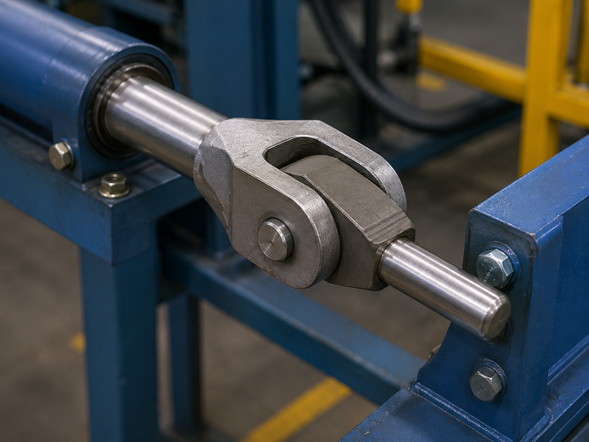

# Context-Rich Solid Mechanics Problem

## Industrial Clevis-Pin Linkage Under Tensile Load

### Engineering Context

A mechanical design team is reviewing a clevis-and-pin linkage used in an industrial actuator assembly. The linkage transfers a tensile force between two cylindrical rod members through a forked yoke and a transverse pin.

This type of connection is common in hydraulic actuators, lifting mechanisms, automated machinery, and mechanical test fixtures.

{fig-alt="Industrial clevis-pin linkage between two rod members in a machine fixture." width=100%}

### Main Engineering Goal

Determine the average normal stress in each rod and the average shear stress in the pin at A. Use the results to identify which idealized component has the largest average stress demand and make a limited mechanics-based recommendation about what additional information would be needed before accepting the connection for service.

### System Components

- left rod / actuator rod;
- yoke / clevis;
- pin at A;
- inner member;
- right rod;
- machine frame / actuator mounts.

