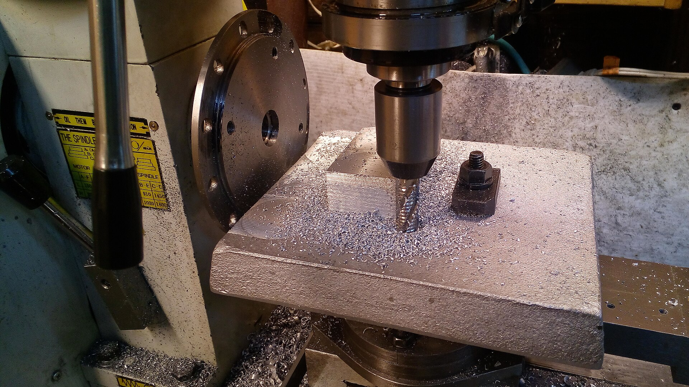

# Context-Rich Solid Mechanics Problem

## End Milling — Combined Bending and Torsion of an End Mill

### Engineering Context

A manufacturing engineer is reviewing a light end-milling operation on an Aluminum 6061 workpiece. As the rotating cutter engages the workpiece, transverse cutting force bends the exposed tool and a tangential force component produces torque about its axis. The exposed cutter is idealized as a solid circular cantilever fixed at the holder face.

The baseline machining context follows Suraidah et al. (2020), including an HSS end mill on Aluminum 6061 and representative operating parameters. The forces, overhang, yield strength, and required factor of safety are instructor-assigned teaching values—not exact force readings, manufacturer ratings, or specifications of the pictured machine. The complete assigned values appear after the modeling questions.

{fig-alt="Representative vertical end-milling operation with an end mill cutting a clamped metal workpiece." width=88%}

*Industry image supplied by the instructor/user. The faculty template identifies a visually matching Wikimedia Commons record, “Roughing Endmill in Use.jpg” by David English (Fixerdave), CC BY-SA 4.0; confirm the exact file/version before public release.*

### Main Engineering Goal

Determine the nominal bending and torsional stresses at the critical outer surface of the exposed cutter, combine them with the von Mises criterion, and assess the simplified static factor of safety. Then determine the transverse force associated with the required factor of safety when the tangential-to-transverse force ratio remains 0.80.

### System Components

- vertical milling-machine spindle;
- tool holder or collet, idealized as the fixed restraint;
- exposed end mill, idealized as the critical solid circular cantilever;
- Aluminum 6061 workpiece and its fixture; and
- machine table and structure carrying the reactions.
