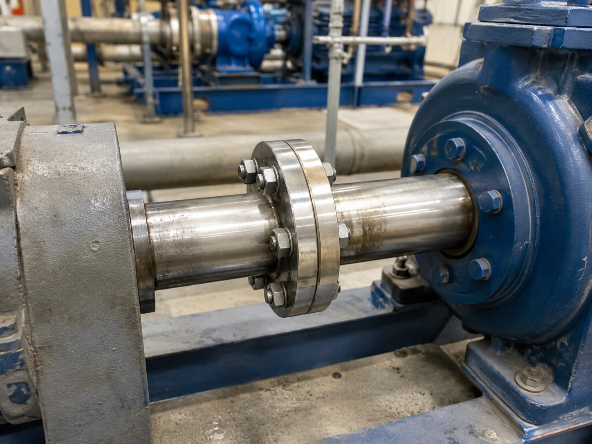

# Context-Rich Solid Mechanics Problem

## Bolt-Group Design for an Industrial Flanged Shaft Coupling

### Engineering Context

Flanged shaft couplings are widely used in industrial power-transmission systems to connect rotating equipment such as electric motors, gearboxes, pumps, compressors, mixers, conveyors, and process machinery. The coupling allows torque produced by the driving machine to pass from one shaft to the other while maintaining rotational continuity between the connected machines.

In a rigid flanged coupling, each shaft is connected to a flange and the two flanges are joined by a circular group of bolts. As torque is transmitted through the connection, the shaft is subjected to torsional shear stress. At the same time, the bolts develop tangential shear forces that collectively provide the resisting moment required to transfer torque from one flange to the other.

The engineering question is intentionally limited to the mechanics of torque transfer. Students compare the torsional shear stress in the solid shaft with the average direct shear stress in the coupling bolts and use that prescribed comparison to determine a suitable bolt count. Detailed effects such as bolt preload, frictional torque transfer, bearing stress, flange flexibility, fatigue, fit, and coupling standards are outside the base analysis.

{fig-alt="Bolted flanged coupling joining two industrial rotating shafts." width=88%}

### Main Engineering Goal

Determine the minimum practical bolt-group configuration required to transmit the shaft torque under the prescribed stress-comparison criterion, and explain how shaft size, bolt size, and bolt-circle radius influence the required number of bolts.

### System Components

- driving shaft;
- driven shaft;
- two mating coupling flanges;
- coupling bolt group;
- driving and driven machinery.
