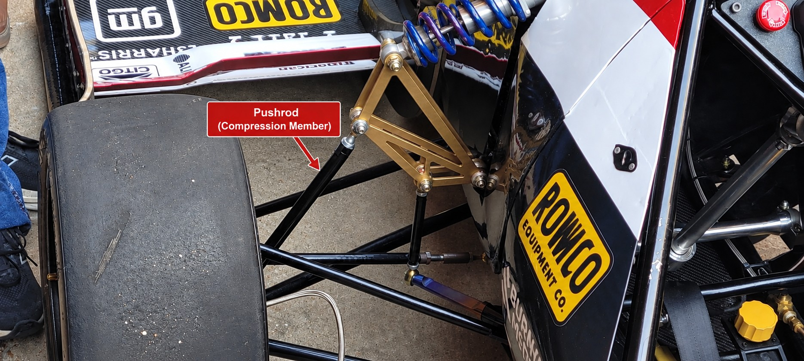

# Context-Rich Solid Mechanics Problem

## Formula SAE Suspension Pushrod - Axial Compression and Column Buckling

### Engineering Context

A Formula SAE vehicle uses a pushrod-actuated suspension to transfer wheel-side force and motion to an inboard rocker and spring-damper. The highlighted black diagonal member is the pushrod selected for this analysis.

{fig-alt="Formula SAE front suspension with a labeled black diagonal pushrod between the wheel-side suspension and the rocker." width=96%}

*User-supplied context photograph. The label identifies only the component selected for analysis; do not infer dimensions or material properties from the image.*

### Main Engineering Goal

Idealize the pushrod as a hollow circular two-force compression member with pin-connected ends. Determine its direct compressive stress and nominal yield margin, evaluate its slenderness and Euler buckling margin, identify which response governs the simplified model, and make a bounded engineering recommendation.

### Analysis Scope

Use an initially straight, prismatic, centrally loaded, linearly elastic, pin-ended column with constant cross section. Do not add baseline bending. Exclude initial crookedness, eccentric loading, joint compliance, threaded insert and rod-end stresses, bolt bending, weld effects, fatigue, impact amplification, and contact nonlinearities from the assigned calculations; address them only as model limitations.
