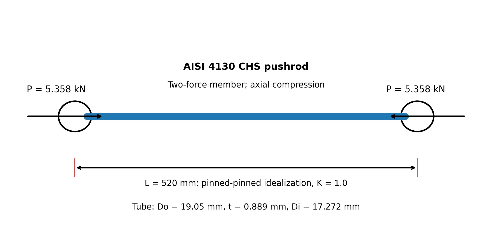

# Purpose

Award credit for tracing the suspension load path, constructing a two-force compression-member idealization, calculating annular section properties, comparing nominal yielding and Euler buckling margins, identifying the governing response, and bounding the conclusion with appropriate limitations.

# Problem Context



# Instructor Reference Idealization

{fig-alt="Instructor-only straight hollow circular pushrod with equal and opposite axial compression loads, pinned ends, length, and tube dimensions." width=96%}

# Generated Question Set and Solutions

```{=html}
<div id="formula-sae-suspension-pushrod-buckling-instructor-questions"></div>
<script src="../../data/problem-catalog.js"></script><script src="../../scripts/packet-renderer.js"></script>
<script>document.addEventListener("DOMContentLoaded",()=>window.renderProblemPacket({slug:"formula-sae-suspension-pushrod-buckling",targetId:"formula-sae-suspension-pushrod-buckling-instructor-questions",type:"instructor"}));</script>
```

# Sources and Value Provenance

The numerical inputs are tied to published Formula Student and Formula SAE work rather than selected for convenient arithmetic.

- Pushrod geometry, full pinned-end critical length, AISI 4130 steel designation, and the 650 MPa yield-strength value are documented in a University of Stavanger master's thesis: <https://uis.brage.unit.no/uis-xmlui/bitstream/handle/11250/183058/Master%20oppgave-endelig.pdf?isAllowed=y&sequence=1>.
- The 5358 N maximum front-pushrod compression force comes from the obstacle load case reported by Arévalo, Medina, and Valladolid; their Formula Student front and rear pushrods work in compression: <https://dspace.ups.edu.ec/bitstream/123456789/16431/1/ings_v20_Ar%C3%A9valo_Medina_Valladolid.pdf>.
- The 205 GPa modulus is cross-checked against a published Formula Student material-property table for 4130 steel: <https://www.mdpi.com/2032-6653/14/9/233>.
- Formula Student Germany team information supplies general pushrod-actuated suspension context: <https://www.formulastudent.de/teams/fsc/details/tid/147>.

The user-supplied industry photograph identifies the analyzed pushrod only. No dimensions or material properties are inferred from the photograph.

# Scope and Model Limitations

The real suspension and bearing-supported rod-end system are reduced to an initially straight, prismatic, centrally loaded, linearly elastic, pin-ended member. The model neglects initial crookedness, eccentric loading, joint compliance, threaded insert and rod-end stresses, bolt bending, weld effects, local bending, fatigue, impact amplification, contact nonlinearities, and other production-design details. Euler buckling is the assigned MEEN 305 stability model, not a complete suspension validation or design-code assessment.
