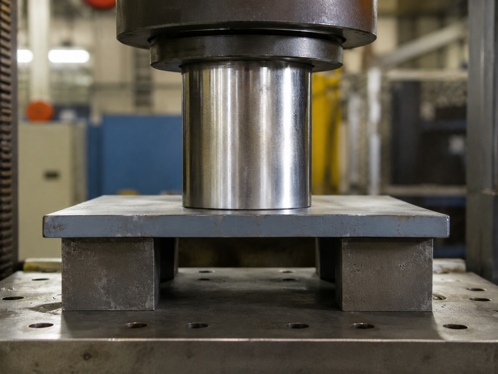

# Context-Rich Solid Mechanics Problem

## Hydraulic Press Punching Shear and Bearing Stress Check

### Engineering Context

A manufacturing engineering team is evaluating a hydraulic press fixture used to apply a vertical compressive load through a cylindrical ram onto a flat metal plate. The plate is supported by two fixture blocks with an opening beneath the loaded region.

This type of setup appears in pressing operations, material testing, tooling qualification, and shop-floor fixtures where concentrated loads are introduced into relatively thin plates.

{fig-alt="Hydraulic press ram pressing onto a flat plate supported by fixture blocks." width=100%}

### Main Engineering Goal

Determine the average punching shear stress developed in the plate along sections AC and BD, and determine the average bearing stress on the plate surface under the cylindrical ram. Use these results to identify which simplified stress quantity is larger and state what additional material data would be needed before accepting the fixture for service.

### System Components

- hydraulic press ram / cylindrical punch;
- flat metal plate;
- left support block;
- right support block;
- opening / unsupported span under the ram;
- press table / fixture base.

