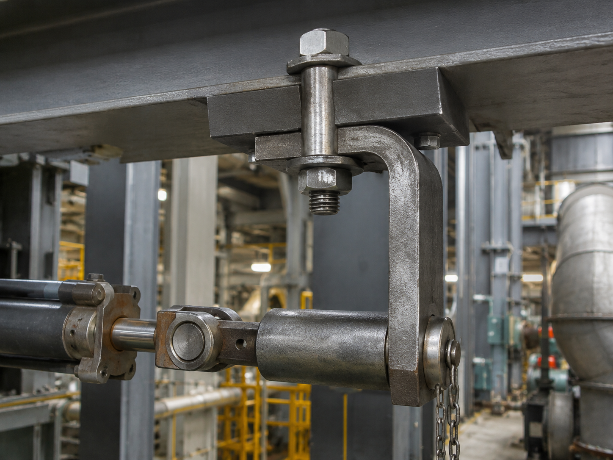

# Context-Rich Solid Mechanics Problem

## Combined Stress Analysis of an Offset Industrial Actuator Support Bracket

### Engineering Context

A production machine uses an offset steel bracket to connect a horizontal actuator or linkage to an overhead machine frame while also supporting a vertical tooling or restraint load near the lower pin. The offset shape provides clearance for nearby equipment, but it makes the applied forces eccentric relative to the centroidal axis of the vertical bracket leg.

During a stationary operating condition, the lower joint transmits a horizontal force and a vertical force. Before examining the bolt, pin, bend, or fatigue details, the engineering team needs a first-order stress state at a rectangular section through the vertical leg.

{fig-alt="Industrial offset steel bracket attached to an overhead frame and connected to a horizontal actuator linkage." width=88%}

### Main Engineering Goal

Determine the internal axial force, transverse shear, and bending moment at section a-a; calculate the normal and transverse shear stresses at points A and B; sketch the local stress elements; and identify the more critical point for the assigned static load case.

### System Components

- offset steel support bracket;
- upper bolted frame attachment;
- lower transverse pin and joint;
- horizontal actuator or linkage;
- vertical tooling or restraint load; and
- overhead machine frame carrying the bracket reactions.
