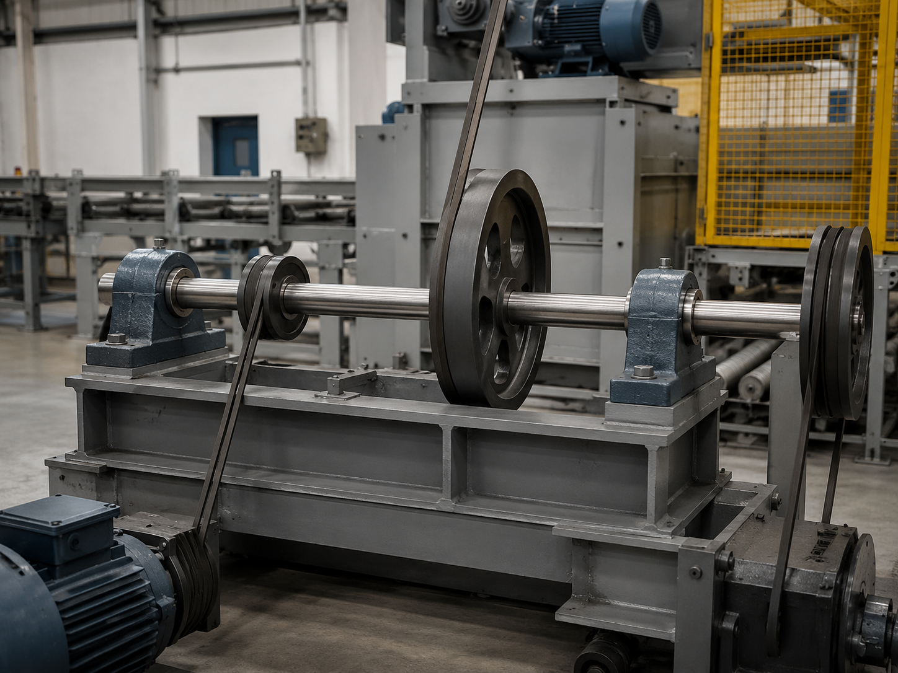

# Context-Rich Solid Mechanics Problem

## Shear and Bending-Moment Analysis of a Multi-Pulley Industrial Line Shaft

### Engineering Context

A production line uses a horizontal shaft to transmit motion between belt-driven conveyor and processing stations. The shaft is supported by pillow-block bearings while several pulleys apply transverse belt-force resultants. One pulley is mounted outside the right bearing, creating an overhung load that can substantially alter the inboard bending moment.

Before selecting a shaft diameter or performing fatigue calculations, the machine-design and maintenance team needs the bearing reactions and complete shear-force and bending-moment diagrams. Those diagrams identify the shaft station that should be examined first in a later stress analysis.

{fig-alt="Belt-driven production-line shaft with several pulleys and pillow-block bearing supports." width=88%}

### Main Engineering Goal

Determine the vertical reactions at bearings A and B, construct the shear-force and bending-moment diagrams, and identify the location and magnitude of the absolute maximum bending moment.

### System Components

- horizontal line shaft;
- pillow-block bearings A and B;
- pulley or sheave 1;
- center pulley or sheave 2;
- overhung pulley or sheave 3;
- belts applying transverse force resultants; and
- machine frame carrying the bearing reactions.
