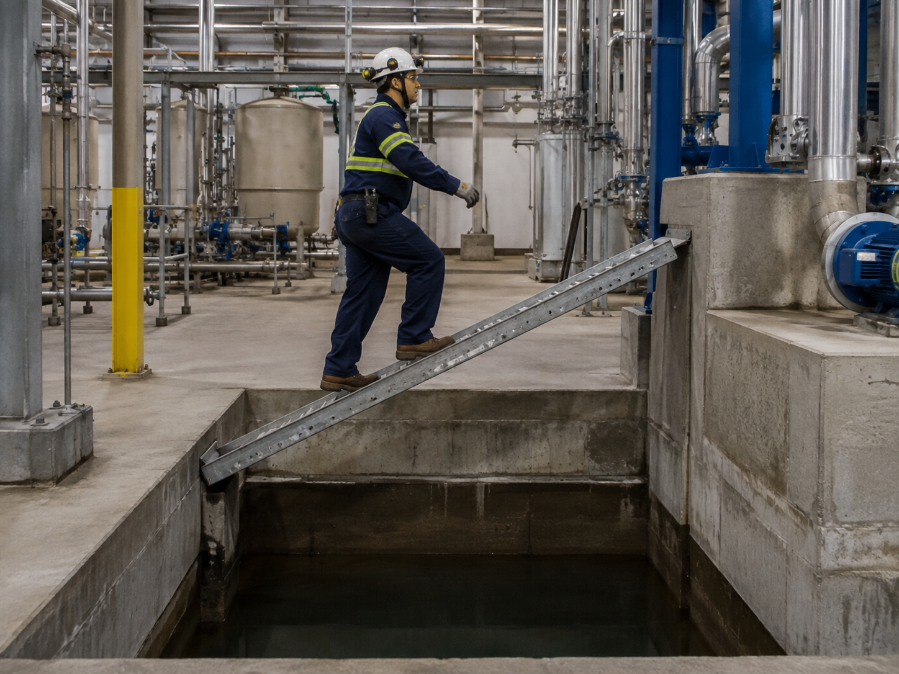

# Context-Rich Solid Mechanics Problem

## Combined-Stress Analysis of an Inclined Industrial Maintenance Access Beam

### Engineering Context

Industrial plants often contain service pits, sumps, trenches, and changes in floor elevation that technicians must cross during inspection or maintenance. During a shutdown or short-duration service task, a temporary inclined access member may be used to reach equipment on the opposite side without installing a permanent stair or platform. The member must support the technician while transferring the load into the surrounding plant structure.

Because the access member is inclined while the technician's weight acts vertically, the load is not purely perpendicular to the member. Relative to the member axis, part of the loading acts along the member and part acts transverse to it. The member therefore develops a combination of axial force, transverse shear force, and bending moment. This makes an inclined access member a useful example of how a single external load can create several internal resultants at the same section.

For this MEEN 305 analysis, the temporary access member is represented by a straight prismatic beam supported at its two ends, with the technician modeled as a concentrated load. The engineering objective is to determine the combined normal and shear stress at a selected point in the member, compare the contributions from axial loading, bending, and transverse shear, and identify which response dominates the local stress state.

{fig-alt="Industrial maintenance technician using an inclined access member across a service pit." width=88%}

### Main Engineering Goal

Determine the state of stress at the selected point on the access member, identify the relative contributions of axial load, bending, and transverse shear, and recommend one mechanics-based change that would reduce the dominant stress contribution.

### System Components

- temporary access beam or plank;
- maintenance technician;
- lower supporting structure; and
- upper supporting structure.
