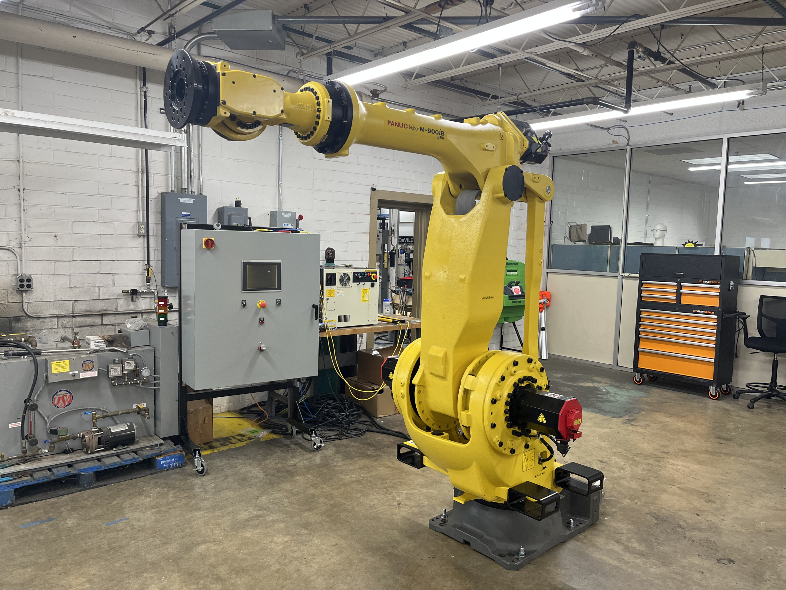

# Context-Rich Solid Mechanics Problem

## Shear and Bending-Moment Analysis of an Industrial Robot Arm

### Engineering Context

Industrial robots are widely used to lift, position, and manipulate parts during material handling, machine tending, assembly, welding, and other manufacturing operations. When the arm reaches outward while holding a component, the payload and the weight of the arm must be transferred through the robot joints and ultimately into the robot body and floor-mounted base. The farther the payload is located from the supporting joint, the larger the bending moment produced by the same payload.

The robot arm itself also contributes to the loading. Its distributed self-weight acts along the reach, while the gripper and payload act near the end of the arm. These loads create internal shear forces and bending moments that vary along the arm. Identifying where the bending moment is largest is an important first step before detailed stress, stiffness, or structural-sizing checks are performed.

For this MEEN 305 analysis, the actual articulated robot, with servo motors, gear reducers, complex joint housings, and three-dimensional geometry, is replaced by an equivalent horizontal beam supported by a pin and an inclined two-force actuator. The actuator is represented as a hydraulic cylinder only to provide a simple known force direction for planar equilibrium; it is an equivalent mechanics model and is not intended to reproduce the actual actuation architecture of the robot shown in the industry image.

{fig-alt="Industrial articulated robot used for manufacturing and material-handling operations." width=88%}

### Main Engineering Goal

Determine the actuator force and support reactions required for static equilibrium, construct the shear-force and bending-moment diagrams for the equivalent robot arm, and identify the location and magnitude of the absolute maximum bending moment so that the critical arm region can be identified for subsequent strength analysis.

### System Components

- robot arm;
- robot joints and actuators;
- end-effector / gripper;
- payload;
- robot body and base.
