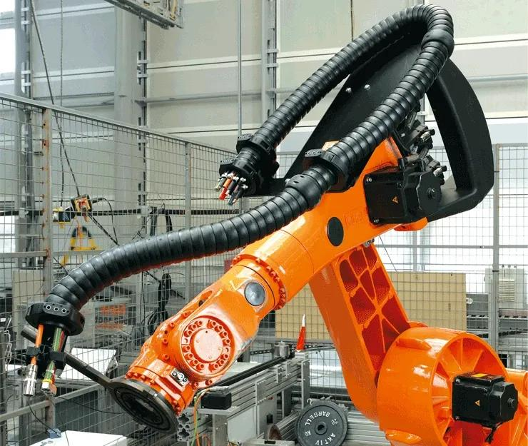

# Context-Rich Solid Mechanics Problem

## Industrial Robot Cable Dress Pack - Bending Curvature and Outer-Fiber Strain

### Engineering Context

Industrial robots route power, data, and control cables through dress packs that move with multiple robot axes. The dress pack guides and protects the cable bundle, and the local route must respect the selected cable manufacturer's bend-radius requirement.

{fig-alt="Industrial robot arm with a flexible cable dress pack routed around its moving joints." width=72%}

*The photograph provides visual context only. Do not infer any cable diameter, bend radius, load, or material property from it.*

### Main Engineering Goal

Evaluate the curvature and maximum geometric longitudinal bending strain in an equivalent circular cable at a specified inner routing radius. Use the result to make a limited routing recommendation without converting the cable to a fictitious homogeneous material.

### Analysis Scope

Model one local cable segment as a circular arc of constant curvature. Interpret the specified routing radius as the inner bend radius, use the equivalent cable centerline as the neutral axis, and apply plane-section kinematics only to estimate geometric longitudinal strain. Exclude force equilibrium, stress, strength, factor of safety, fatigue-life prediction, strand slip, conductor lay, shielding, jacket and insulation constitutive behavior, torsion, contact, and viscoelastic effects.
