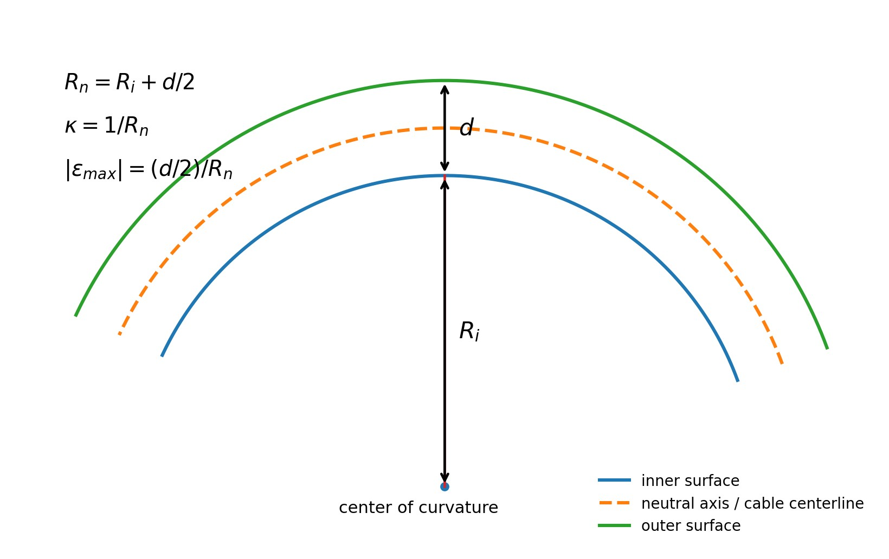

# Purpose

Award credit for connecting robot motion to an imposed cable curvature, distinguishing the manufacturer's inner bend radius from the neutral-axis radius, applying the curvature-strain relation, interpreting the result as equivalent geometric strain, and making a bounded routing recommendation.

# Problem Context



# Instructor Reference Idealization

{fig-alt="Instructor-only circular-arc cable idealization with inner radius Ri, centerline radius Rn, diameter d, and outer-fiber strain equations." width=84%}

The specified routing radius is the inner radius, so the neutral-axis radius used in the curvature relation is (R_n=R_i+d/2). The maximum strain magnitudes occur at the inner and outer surfaces, (y=\pm d/2), with opposite signs under the adopted convention.

# Generated Question Set and Solutions

```{=html}
<div id="industrial-robot-cable-bending-curvature-instructor-questions"></div>
<script src="../../data/problem-catalog.js"></script><script src="../../scripts/packet-renderer.js"></script>
<script>document.addEventListener("DOMContentLoaded",()=>window.renderProblemPacket({slug:"industrial-robot-cable-bending-curvature",targetId:"industrial-robot-cable-bending-curvature-instructor-questions",type:"instructor"}));</script>
```

# Sources and Value Provenance

- igus CFROBOT8.PLUS.022 technical data supplies the 9.5 mm cable outer diameter.
- igus CFROBOT8 robotics/chainflex documentation supplies the minimum dynamic bend-radius factor of 10 times cable diameter.
- igus bend-radius guidance defines the cable bend radius at the inner curvature; therefore the mechanics calculation first converts to (R_n=R_i+d/2).
- The supplied robot photograph is visual context only; no numerical input is inferred from it.

# Scope and Model Limitations

The reported result is geometric outer-fiber strain in an equivalent homogeneous circular-cable kinematic model. It is not asserted to be the actual strain in every conductor, shield wire, insulation layer, or jacket constituent. A detailed cable assessment would require cable-specific models for strand slip, conductor lay, shielding, jacket and insulation behavior, torsion, contact, fatigue, and viscoelasticity. No modulus, cable stress, strength, factor of safety, or fatigue life is calculated.
