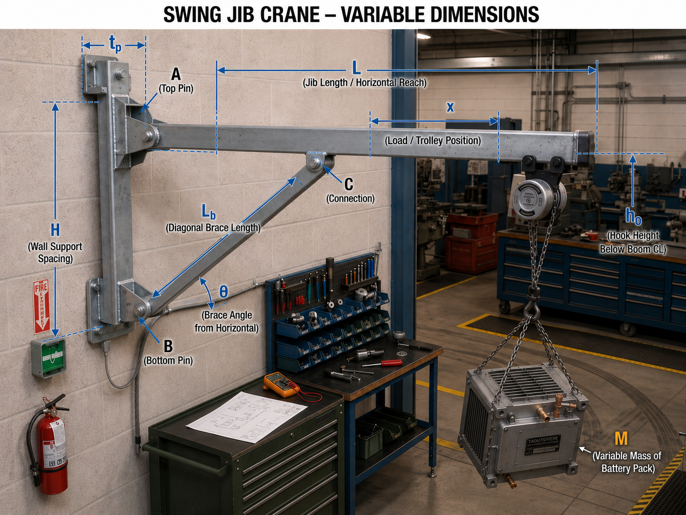

# Industry Context and Engineering Mission

You are a manufacturing engineer responsible for the preliminary design of a compact, wall-mounted swing-jib crane for an automotive assembly line. The crane will lift battery packs from a staging fixture, move them through a restricted workstation, and position them for installation into vehicle frames.

The crane will operate repeatedly throughout each production shift. During a typical cycle, the battery pack is lifted, translated along the boom, rotated about the wall-mounted support, stopped, positioned, and lowered into the vehicle frame. The crane must therefore provide adequate strength, stiffness, stability, fatigue resistance, positioning accuracy, and operational safety.

Only a preliminary concept image and variable-based geometry are currently available. The final dimensions, structural materials, connection details, operating speed, allowable deflection, and design load have not yet been specified.

{fig-alt="A wall-mounted swing-jib crane lifting a heavy industrial component in an automotive manufacturing environment." width=100%}

## Engineering Design Goal

Determine whether the proposed swing-jib crane configuration can be developed into a safe and practical system for lifting automotive battery packs.

Your final recommendation must:

1. establish a defensible design load for the crane;
2. identify the critical dimensions, materials, members, and connections;
3. convert the real crane into an appropriate two-dimensional structural model;
4. determine the forces transmitted through the boom, brace, wall supports, and connection pins;
5. evaluate the governing strength, stiffness, stability, and fatigue criteria;
6. identify the component or failure mode most likely to control the design;
7. recommend whether the proposed concept should be:

   * accepted for detailed design,
   * modified,
   * or rejected.

## Required Engineering Deliverables

Your submission must include:

* a description of the operating requirements and credible loading conditions;
* justified estimates for quantities not provided;
* proposed material choices and relevant material properties;
* identification of critical geometric parameters;
* a simplified two-dimensional structural diagram;
* a complete free-body diagram;
* governing equilibrium and mechanics equations;
* evaluation criteria for yielding, ultimate failure, pin shear, bearing, buckling, fatigue, and deflection;
* a preliminary design recommendation;
* a list of additional information required before final approval.

## Scope of the Preliminary Analysis

The purpose of this stage is not to complete the final certified crane design. The purpose is to determine whether the proposed structural configuration is mechanically feasible and to identify the parameters and failure modes that must control the detailed design.

The initial analysis may use a two-dimensional equivalent-static model, provided that the assumptions and excluded three-dimensional or dynamic effects are clearly identified.

# Preliminary Engineering Questions

## Q1. Design, Manufacturing, and Commercialization Considerations

What functional, safety, manufacturing, operational, installation, maintenance, and commercial
considerations should influence the design of the swing-jib crane?

In the discussion, consider:

- lifting capacity;
- horizontal reach;
- swing range;
- trolley travel;
- positioning accuracy;
- available workspace;
- interaction with operators and nearby equipment;
- manufacturability;
- use of standard components;
- transport and installation;
- maintenance and inspection;
- reliability and production downtime;
- cost;
- rated capacity and labeling;
- product liability and misuse;
- expected service life.

Conclude by identifying the three most important requirements that must be satisfied before
the crane can be approved for production use.

## Q2. Material Selection

How should the materials for the boom, diagonal brace, mounting plates, pins, bolts, wall
anchors, chain, hook, and other lifting components be selected?

For each major component, identify the material properties that are most important. Consider:

- elastic modulus;
- yield strength;
- ultimate strength;
- shear strength;
- fatigue resistance;
- fracture toughness;
- hardness and wear resistance;
- corrosion resistance;
- weldability;
- machinability;
- density;
- cost;
- availability.

Explain why all components of the crane should not necessarily be manufactured from the same material.

## Q3. Critical Geometrical Parameters

Which geometrical parameters are expected to have the greatest effect on load transfer, stress,
deflection, stability, fatigue life, and connection performance?

Consider:

- boom length;
- location of the trolley and suspended load;
- vertical spacing between wall connections;
- diagonal-brace angle;
- boom cross-sectional dimensions;
- brace cross-sectional dimensions;
- member wall thickness;
- pin diameter;
- hole diameter;
- plate thickness;
- edge distance;
- weld length and weld throat;
- wall-anchor spacing;
- connection eccentricity;
- unsupported member length.

Classify the identified parameters as:

1. system-level geometry;
2. member-level geometry;
3. connection-level geometry.

Identify which dimensions should be measured directly and which could initially be estimated.

## Q4. Loading Identification, Estimation, and Classification

What loads may act on the crane during normal operation, abnormal operation, installation,
and maintenance?

Estimate or propose a method to estimate:

- battery-pack weight;
- lifting-fixture weight;
- chain-hoist and trolley weight;
- boom and brace self-weight;
- acceleration and deceleration effects;
- load swing;
- starting and stopping forces;
- impact during lifting or positioning;
- accidental overload;
- horizontal operator force;
- side loading;
- repeated loading cycles.

Classify each load as one or more of the following:

- static;
- quasi-static;
- dynamic;
- impact;
- cyclic;
- accidental.

Develop a preliminary design-load expression. Clearly distinguish between:

- nominal load;
- maximum expected service load;
- maximum credible load;
- factored design load.

State which load cases or load combinations are likely to govern.

## Q5. Critical Locations and Strength, Stiffness, and Deflection Considerations

Identify the components and locations most likely to control the structural design.

For each location, identify the relevant response or potential failure mode, such as:

- yielding;
- fracture;
- pin shear;
- pin bending;
- bearing failure;
- plate tear-out;
- net-section failure;
- weld failure;
- wall-anchor failure;
- brace buckling;
- boom bending;
- torsion;
- local buckling;
- fatigue cracking;
- excessive tip deflection;
- excessive rotation;
- joint looseness;
- loss of positioning accuracy.

Separate the discussion into:

1. strength-critical locations;
2. stiffness- or serviceability-critical locations;
3. stability-critical locations;
4. fatigue-critical locations.

Explain why a design that satisfies strength requirements may still be unacceptable in service.

## Q6. Numerical Evaluation and Acceptance Criteria

What numerical criteria should be used to determine whether the crane is acceptable?

Discuss the appropriate use of:

- yield strength;
- ultimate strength;
- allowable stress;
- factor of safety;
- shear-yield criteria;
- bearing limits;
- buckling capacity;
- fatigue strength;
- deflection limits;
- rotation limits;
- proof-load requirements;
- rated-load requirements.

For each major component or failure mode, identify:

1. the calculated response quantity;
2. the corresponding allowable or limiting value;
3. an appropriate factor of safety or design margin;
4. whether the criterion is related to strength, stiffness, stability, fatigue, or serviceability.

Explain why comparison with ultimate strength alone is generally insufficient for a reusable lifting device.

# Structural Idealization

After completing Questions 1–6, convert the real crane into a simplified two-dimensional
structural diagram.

Your idealization should:

- preserve the dominant load path;
- replace members with suitable centerlines;
- represent physical joints using appropriate idealized connections;
- show the boom, brace, wall supports, trolley, hoist, and suspended load;
- retain dimensions that affect equilibrium and internal forces;
- omit features that have negligible first-order influence;
- identify effects that cannot be represented adequately by a 2D model.

Justify:

- why a 2D model is or is not appropriate;
- how the wall connections are represented;
- whether the brace behaves as a two-force member;
- whether the boom should be modeled as a beam;
- whether trolley eccentricity should be included;
- whether self-weight should be included;
- whether dynamic loading can initially be represented using an amplification factor.

::: {.callout-note}
## Instructor release

First submit your own 2D idealization. The instructor may then release the reference idealized model for the numerical-analysis phase. Example
diagram,

{fig-alt="Two-dimensional idealized side view showing the wall supports, horizontal boom, diagonal brace, trolley position, hook height, and battery-pack mass." width=100%}

:::

# Free-Body Diagram

Draw a free-body diagram of the complete crane.

The free-body diagram should include:

- the battery-pack design load;
- lifting-fixture and hoist weight, when relevant;
- boom and brace self-weight, when relevant;
- wall-support reactions;
- horizontal dynamic or swing forces, when relevant;
- relevant dimensions and moment arms;
- coordinate directions;
- clearly stated sign conventions.

Do not draw reaction components that are inconsistent with the selected support idealization.

# Engineering Decision

Based on the preliminary assessment, state whether the crane should be:

- approved for detailed analysis;
- approved only with specified operating restrictions;
- redesigned;
- or held pending additional information.

Identify the three pieces of missing information that would most improve confidence in the
preliminary engineering decision.
