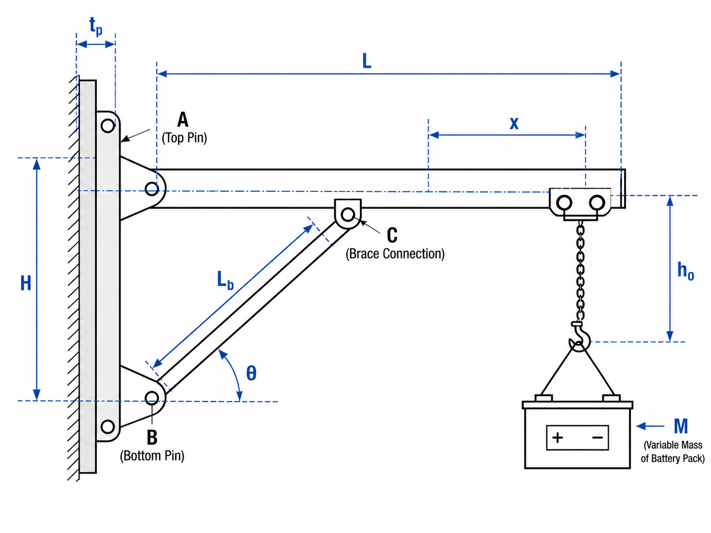

# Purpose

These are representative answers, not the only acceptable answers. Student work should be evaluated based on physical reasoning, quality of assumptions, completeness, consistency, and connection to mechanics.

# Main Engineering Task — Representative Answer

The crane must safely lift, translate, swing, position, and lower a battery pack during repeated automotive assembly operations. A complete preliminary assessment requires the rated battery-pack mass, boom reach, wall-support geometry, member sections, connection details, material properties, operating speed, acceleration, expected cycle count, allowable positioning error, and supporting-wall capacity.

The crane should be evaluated for:

* static strength;
* dynamic amplification;
* fatigue;
* buckling;
* deflection;
* joint deformation;
* wall-anchor capacity;
* lifting-component capacity;
* safe operation;
* credible misuse.

Approval should not be based on a static stress calculation of only one member or pin.

# Generated Question Set and Solutions

```{=html}
<div id="jib-crane-instructor-questions"></div>
<script src="../../data/problem-catalog.js"></script>
<script src="../../scripts/packet-renderer.js"></script>
<script>
document.addEventListener("DOMContentLoaded", () => {
  window.renderProblemPacket({
    slug: "jib-crane-battery-pack",
    targetId: "jib-crane-instructor-questions",
    type: "instructor"
  });
});
</script>
```

# Supplemental Instructor Background

The following notes support grading, discussion, and future packet variants. They are not the default student question sequence.

## Design, Manufacturing, and Commercialization

The primary function of the crane is to lift and position battery packs accurately and repeatedly without damaging the battery, vehicle, crane, surrounding equipment, or operators.

Functional requirements include:

* rated lifting capacity;
* adequate horizontal reach;
* required swing range;
* sufficient trolley travel;
* controlled vertical motion;
* positioning accuracy;
* compatibility with the battery lifting fixture;
* operation within the available workstation envelope.

Safety considerations include:

* overload prevention;
* reliable brakes and stops;
* control of load swing;
* protection against dropped loads;
* certified lifting attachments;
* guarding of pinch points;
* safe operator access;
* emergency stopping;
* rated-load labeling;
* formal inspection requirements.

Manufacturing considerations include:

* use of standard structural sections;
* weld accessibility;
* dimensional tolerances;
* standard pins and fasteners;
* corrosion protection;
* reduced number of unique components;
* ease of fabrication and assembly.

Commercial considerations include:

* purchase price;
* installation cost;
* shipping weight;
* service life;
* maintenance cost;
* replacement-part availability;
* warranty;
* compliance documentation;
* product liability;
* production downtime.

Three likely governing requirements are:

1. safe support of rated and dynamically amplified design loads;
2. acceptable deflection and positioning accuracy;
3. adequate reliability and fatigue life under repeated production cycles.

## Material Selection

Different components experience different loading and service conditions. Therefore, one material is unlikely to be optimal for the entire crane.

## Boom and brace

Important material properties include:

* elastic modulus;
* yield strength;
* fatigue strength;
* fracture toughness;
* weldability;
* corrosion resistance;
* density;
* cost;
* commercial availability.

The elastic modulus, $E$, strongly influences elastic deformation and stiffness. The yield strength, $\sigma_y$, controls the onset of permanent deformation.

Structural steel is a likely candidate because of its relatively high stiffness, weldability, availability, and moderate cost.

An aluminum alloy may reduce structural mass and improve corrosion resistance. However, its lower elastic modulus generally produces greater deformation for a comparable geometry. Material selection must therefore be considered together with member cross-sectional design.

## Pins

Pins may experience:

* transverse shear;
* bearing;
* bending;
* cyclic contact;
* wear;
* fatigue.

Important material properties include:

* shear yield strength;
* bending strength;
* fracture toughness;
* fatigue resistance;
* hardness;
* wear resistance;
* machinability.

Pins may therefore be manufactured from higher-strength or heat-treated steel. However, excessive hardness without adequate toughness may increase sensitivity to brittle fracture.

## Mounting plates and brackets

Important material properties include:

* yield strength;
* bearing strength;
* toughness;
* weldability;
* resistance to local plate bending;
* corrosion resistance.

## Bolts and anchors

Important considerations include:

* tensile strength;
* shear strength;
* pretension capability;
* fatigue resistance;
* corrosion resistance;
* installation requirements;
* compatibility with the supporting wall or structural frame.

## Chain, hook, and hoist hardware

Chains, hooks, hoists, trolleys, and below-the-hook lifting devices should generally be selected as rated and traceable lifting components rather than designed only from nominal material strength.

The principal distinctions are:

* $E$ controls elastic deformation;
* $\sigma_y$ controls the onset of permanent deformation;
* $\sigma_u$ relates to ultimate fracture capacity;
* fatigue properties control repeated-cycle durability;
* hardness and wear resistance are particularly important at pins and moving contacts.

## Critical Geometrical Parameters

## System-level geometry

Important system-level parameters include:

* boom length, $L$;
* trolley or load position, $x$;
* vertical spacing between wall supports, $h$;
* brace angle, $\theta$;
* load eccentricity;
* crane swing angle;
* hook height;
* distance between the battery pack and boom.

The moment transferred to the supporting wall or column increases approximately as

$$
M_{\mathrm{wall}}
\approx
P x.
$$

Therefore, increasing the load position (x) increases:

* wall reactions;
* boom bending moment;
* connection forces;
* structural deflection.

Increasing the vertical spacing between wall reaction points may reduce the forces required to develop the resisting support couple.

## Member-level geometry

Important member-level parameters include:

* cross-sectional area, (A);
* second moment of area, (I);
* section modulus, (S);
* torsional constant, (J);
* member wall thickness;
* unsupported brace length;
* radius of gyration, (r);
* effective-length factor, (K).

For bending stress,

$$
\sigma_b = \frac{M}{S} = \frac{Mc}{I}.
$$

For a compression brace, the member slenderness ratio may be expressed as

$$
\lambda = \frac{KL}{r}.
$$

## Connection-level geometry

Important connection-level parameters include:

* pin diameter, (d);
* number of effective shear planes, (n);
* plate thickness, (t);
* hole diameter;
* edge distance;
* weld throat;
* weld length;
* bolt spacing;
* anchor spacing;
* clevis gap;
* connection eccentricity.

For idealized average pin shear,

$$
\tau_{\mathrm{avg}} =
\frac{V}{n\left(\dfrac{\pi d^2}{4}\right)}.
$$

For nominal plate bearing stress,

$$
\sigma_{\mathrm{bearing}} = \frac{V}{td}.
$$

Pin shear area scales with (d^2), while nominal bearing stress varies inversely with the product (td).

The following dimensions should be measured directly whenever possible:

* boom length;
* support spacing;
* section dimensions;
* pin diameters;
* plate thicknesses;
* anchor spacing;
* load position;
* connection eccentricity.

The assumption that two shear planes carry equal force is an idealization used in average-stress analysis. Actual contact and load distribution may be nonuniform.

## Loading Identification and Estimation

The crane is not subjected only to a constant payload dead weight.

Potential loads include:

* battery-pack weight;
* lifting-fixture weight;
* hoist weight;
* trolley weight;
* boom self-weight;
* brace self-weight;
* lifting acceleration;
* braking and stopping forces;
* crane swing;
* trolley acceleration;
* load oscillation;
* impact;
* side loading;
* accidental overload;
* repeated operating cycles.

## Vertical service load

A preliminary vertical service load may be written as

$$
P_{\mathrm{service}} =
W_{\mathrm{battery}}
+
W_{\mathrm{fixture}}
+
W_{\mathrm{hoist}}
+
W_{\mathrm{trolley}}.
$$

The boom and brace self-weights may be modeled separately as distributed loads or equivalent concentrated loads.

## Dynamically amplified load

A preliminary dynamically amplified load may be written as

$$
P_{\mathrm{dynamic}} = \gamma_d P_{\mathrm{service}},
$$

where $\gamma_d$ is a dynamic amplification factor representing the effects of:

* lifting acceleration;
* stopping;
* braking;
* impact;
* operational uncertainty.

A more general preliminary vertical design-load model is

$$
P_{\mathrm{design}} =
\gamma_d
\left(
W_{\mathrm{battery}}
+
W_{\mathrm{fixture}}
+
W_{\mathrm{hoist}}
+
W_{\mathrm{trolley}}
\right)
+
W_{\mathrm{structure}}.
$$

The dynamic factor $\gamma_d$ should not be treated as a universal constant. It should be obtained from:

* an applicable design standard;
* manufacturer guidance;
* measured acceleration;
* operational requirements;
* or a clearly stated course assumption.

## Horizontal loading

Potential horizontal loading caused by swing, trolley travel, or braking may initially be represented as

$$
H = m a_h,
$$

where:

* (m) is the accelerated mass;
* (a_h) is the horizontal acceleration.

If detailed acceleration information is unavailable, a justified equivalent horizontal-load assumption may be used for preliminary analysis.

## Loading classification

Typical load classifications include:

* battery-pack weight: static during steady holding;
* fixture, hoist, and trolley weights: static;
* lifting acceleration: dynamic;
* stopping and braking: dynamic;
* sudden hoist engagement: impact;
* repeated lifting operations: cyclic;
* accidental overload: abnormal;
* side pull: abnormal and potentially dynamic;
* structural self-weight: static.

Likely governing load cases include:

1. rated load at maximum trolley reach;
2. dynamically amplified vertical load;
3. combined vertical and horizontal loading during swing or braking;
4. repeated fatigue loading over the expected service life;
5. overload or proof-load condition.

## Critical Locations and Structural Responses

## Strength-critical locations

Likely strength-critical locations include:

* boom near the wall connection;
* boom-to-wall bracket connection;
* brace-to-wall connection;
* boom-to-brace connection;
* pins;
* pin holes;
* mounting plates;
* weld toes;
* wall anchors;
* trolley attachment region;
* hook and chain;
* lifting fixture.

Potential failure modes include:

* yielding;
* fracture;
* pin shear;
* pin bending;
* bearing deformation;
* plate tear-out;
* net-section rupture;
* weld failure;
* anchor pullout;
* local plate bending.

## Stability-critical locations

Likely stability-critical locations include:

* diagonal brace when subjected to compression;
* slender wall brackets;
* thin-walled boom sections;
* mounting plates susceptible to local buckling.

The brace must be checked for:

* material yielding;
* elastic buckling;
* inelastic buckling;
* end-condition sensitivity.

## Stiffness-critical locations

Likely stiffness-critical quantities include:

* boom-tip displacement;
* trolley displacement;
* hook displacement;
* wall-bracket rotation;
* joint clearance;
* pin deformation;
* supporting-wall deformation;
* local deformation beneath the trolley.

Excessive deformation may cause:

* loss of battery positioning accuracy;
* insufficient clearance;
* trolley drift along a deflected boom;
* increased load swing;
* interference with the vehicle;
* interference with nearby tooling;
* poor operator confidence.

## Fatigue-critical locations

Likely fatigue-critical locations include:

* weld toes;
* pin holes;
* bolt holes;
* section transitions;
* repeated-contact regions;
* wall connection details;
* regions experiencing repeated stress fluctuations.

A design may remain below yield but still be unacceptable because of:

* excessive elastic deflection;
* vibration;
* joint looseness;
* instability;
* fatigue accumulation;
* wear;
* reduced positioning accuracy.

## Numerical Evaluation Criteria

No single stress criterion is sufficient for evaluating the complete crane.

## Yielding of ductile structural members

For ductile structural members under static or quasi-static loading, yielding may be checked using a von Mises equivalent-stress criterion:

$$
\sigma_{\mathrm{vm}}
\leq
\frac{\sigma_y}{N_y},
$$

where:

* $\sigma_{\mathrm{vm}}$ is the von Mises equivalent stress;
* $\sigma_y$ is the material yield strength;
* $N_y$ is the required factor of safety against yielding.

Yield strength is important because permanent deformation may:

* misalign the boom;
* change the intended load path;
* prevent trolley motion;
* produce permanent hook displacement;
* make the crane unserviceable.

## Ultimate failure

A separate ultimate or fracture check may be written generally as

$$
R_{\mathrm{demand}}
\leq
\frac{R_{\mathrm{ultimate}}}{N_u},
$$

where:

* $R_{\mathrm{demand}}$ is the calculated demand;
* $R_{\mathrm{ultimate}}$ is the relevant ultimate resistance;
* $N_u$ is the required design factor.

Ultimate strength may be relevant for:

* net-section rupture;
* fracture;
* bolts;
* anchors;
* welds;
* lifting hardware.

Ultimate strength is not a replacement for a yield check.

## Pin shear

For a pin with (n) effective shear planes,

$$
\tau_{\mathrm{avg}} = \frac{V}{nA_p},
$$

where

$$
A_p = \frac{\pi d^2}{4}.
$$

Therefore,

$$
\tau_{\mathrm{avg}} = \frac{4V}{n\pi d^2}.
$$

For a ductile material, a von Mises-based estimate of shear yield strength is

$$
\tau_y
\approx
\frac{\sigma_y}{\sqrt{3}}
\approx
0.577\sigma_y.
$$

This relationship estimates shear yielding from tensile yield strength. It is not, by itself, a complete design allowable.

Pins may also require checks for:

* bending;
* bearing;
* combined stress;
* fatigue;
* wear;
* deformation.

## Bearing

Nominal bearing stress may be estimated as

$$
\sigma_{\mathrm{bearing}} = \frac{V}{td}.
$$

The bearing criterion may be written as

$$
\sigma_{\mathrm{bearing}}
\leq
\sigma_{\mathrm{bearing,allow}}.
$$

## Buckling

For a compression brace,

$$
P_{\mathrm{brace}}
\leq
P_{\mathrm{allowable}},
$$

where $P_{\mathrm{allowable}}$ must account for the applicable failure mode:

* material yielding;
* inelastic buckling;
* elastic buckling;
* local buckling.

For an ideal slender column, the Euler critical load is

$$
P_{\mathrm{cr}} = \frac{\pi^2 EI}{(KL)^2}.
$$

Euler buckling should be used only when its assumptions are appropriate.

## Deflection and rotation

The load-point displacement should satisfy

$$
\delta_{\mathrm{load}}
\leq
\delta_{\mathrm{allow}}.
$$

The boom rotation may be limited by

$$
\theta_{\mathrm{boom}}
\leq
\theta_{\mathrm{allow}}.
$$

Allowable deflection and rotation should be based on:

* battery positioning tolerance;
* required clearance;
* trolley performance;
* operator control;
* serviceability;
* interference prevention.

## Fatigue

For repeated operation, the stress range and cycle count should be evaluated using appropriate fatigue data or design provisions.

A general fatigue criterion may be written as

$$
\Delta \sigma
\leq
\Delta \sigma_{\mathrm{allow}}(N),
$$

where:

* $\Delta \sigma$ is the calculated stress range;
* $N$ is the expected number of cycles;
* $\Delta \sigma_{\mathrm{allow}}(N)$ is the allowable stress range for that life.

## Lifting hardware

Chains, hooks, hoists, trolleys, and below-the-hook lifting devices should be checked using:

* documented rated working loads;
* manufacturer requirements;
* inspection requirements;
* proof-test requirements;
* applicable lifting-device standards.

They should not be evaluated only by dividing nominal material strength by a generic factor of safety.

## Recommended evaluation hierarchy

A suitable evaluation hierarchy is:

* yield for reusable ductile structural components;
* ultimate resistance for fracture and rupture;
* buckling for compression members;
* fatigue for repeated production operation;
* bearing and tear-out for pin-connected plates;
* deflection and rotation for positioning and serviceability;
* rated-load and proof-load requirements for lifting hardware.

## 2D Idealization — Representative Reasoning

{fig-alt="Two-dimensional idealized side view showing the wall supports, horizontal boom, diagonal brace, trolley position, hook height, and battery-pack mass." width=100%}

A two-dimensional model may be suitable for preliminary in-plane analysis when:

* the applied load acts approximately in the boom-brace plane;
* out-of-plane eccentricity is small;
* the crane is evaluated at a specified swing orientation;
* torsion is checked separately or shown to be negligible.

The two-dimensional model may omit:

* torsion caused by load eccentricity;
* out-of-plane swing;
* local connection deformation;
* flexibility of the supporting wall;
* three-dimensional anchor-group behavior;
* chain dynamics;
* trolley-wheel contact;
* local weld stress concentrations.

The boom may be represented as a beam because it may carry:

* transverse loads;
* bending moment;
* shear force;
* self-weight;
* trolley loading.

The diagonal brace may be approximated as a two-force member when:

* it is connected by idealized pins;
* external loads act only at its ends;
* member self-weight is neglected or treated separately;
* connection eccentricity is negligible.

The wall supports must be idealized from the actual crane configuration rather than copied directly from a textbook support model.

The simplified model should preserve:

* the dominant load path;
* boom length;
* load location;
* wall-support spacing;
* brace angle;
* relevant support constraints.

## Baseline Numerical Solution

The following baseline solution corresponds to the default Section A values in the Instructor Builder:

| Quantity | Value |
|---|---:|
| Boom length, $L$ | 2.4 m |
| Brace attachment distance, $L_b$ | 1.6 m |
| Brace angle, $\theta$ | 35 deg |
| Battery mass, $M$ | 450 kg |
| Horizontal load, $H$ | 500 N |
| Horizontal-load vertical offset, $e_H$ | 0.3 m |
| Dynamic load factor, $\gamma_d$ | 1.25 |
| Boom section modulus, $S$ | 85,000 mm^3 |
| Boom second moment of area, $I$ | 8,500,000 mm^4 |
| Brace area, $A_b$ | 650 mm^2 |
| Pin diameter, $d_p$ | 20 mm |
| Plate thickness, $t$ | 12 mm |
| Yield strength, $\sigma_y$ | 250 MPa |
| Yield safety factor, $N_y$ | 2 |
| Allowable deflection, $\delta_{\mathrm{allow}}$ | 10 mm |
| Brace effective-length factor, $K$ | 1 |
| Brace radius of gyration, $r_{\min}$ | 28 mm |
| Brace buckling inertia, $I_b$ | 1,200,000 mm^4 |
| Buckling safety factor, $N_b$ | 2 |
| Pin shear planes, $n_s$ | 1 |
| Allowable pin shear stress, $\tau_{\mathrm{allow}}$ | 80 MPa |
| Allowable plate bearing stress, $\sigma_{\mathrm{bearing,allow}}$ | 150 MPa |

The battery weight is:

$$
W = Mg = (450)(9.81) = 4415\ \mathrm{N}.
$$

The preliminary vertical design load is:

$$
P_{\mathrm{design}} = \gamma_d W = (1.25)(4415) = 5518\ \mathrm{N}.
$$

Taking moments about the wall pin for the idealized boom-brace model:

$$
M_{\mathrm{gov}} = P_{\mathrm{design}}L + He_H
= (5518)(2.4) + (500)(0.3)
= 13394\ \mathrm{N\,m}.
$$

Therefore,

$$
F_{by}x_C = M_{\mathrm{gov}}
$$

so

$$
F_{by} = \frac{13394}{1.6} = 8371\ \mathrm{N}.
$$

The brace axial force is:

$$
F_b = \frac{F_{by}}{\sin 35^\circ} = 14594\ \mathrm{N}.
$$

The horizontal brace force component delivered to the wall is:

$$
F_{bx} = F_b \cos 35^\circ = 11955\ \mathrm{N}.
$$

With the sign convention used in the generated instructor solution, the wall-pin reactions are:

$$
A_x = -(F_{bx}+H) = -12455\ \mathrm{N},
$$

and

$$
A_y = P_{\mathrm{design}} - F_{by} = -2853\ \mathrm{N}.
$$

For the braced boom model, the maximum preliminary bending moment is:

$$
M_{\max} = |M_{\mathrm{gov}} - P_{\mathrm{design}}x_C|
= 4565\ \mathrm{N\,m}.
$$

Using $S = 85000\ \mathrm{mm^3}$,

$$
\sigma_{\max} = \frac{M_{\max}(1000)}{S} = 53.7\ \mathrm{MPa}.
$$

The allowable yield stress is:

$$
\frac{\sigma_y}{N_y} = \frac{250}{2} = 125.0\ \mathrm{MPa}.
$$

The boom bending utilization ratio is therefore:

$$
\frac{53.7}{125.0} = 0.43.
$$

For the conservative unbraced cantilever comparison:

$$
M_{\mathrm{wall}} = P_{\mathrm{design}}L = 13244\ \mathrm{N\,m},
$$

$$
\sigma_b = \frac{M_{\mathrm{wall}}(1000)}{S} = 155.8\ \mathrm{MPa},
$$

and

$$
\delta = \frac{P_{\mathrm{design}}L^3}{3EI} = 15.0\ \mathrm{mm}.
$$

The deflection utilization ratio is:

$$
\frac{15.0}{10.0} = 1.50.
$$

For the brace connection, assuming a single-shear pin idealization:

$$
\tau_{\mathrm{pin}} = \frac{F_b}{n_s\pi d_p^2/4} = 46.5\ \mathrm{MPa}.
$$

The average plate bearing stress is:

$$
\sigma_{\mathrm{bearing}} = \frac{F_b}{td_p} = 60.8\ \mathrm{MPa}.
$$

The brace length estimate is:

$$
L_{\mathrm{brace}} = \frac{L_b}{\cos 35^\circ} = 1.95\ \mathrm{m}.
$$

The brace axial stress magnitude is:

$$
\sigma_{\mathrm{brace}} = \frac{F_b}{A_b} = 22.5\ \mathrm{MPa}.
$$

The brace slenderness ratio is:

$$
\frac{KL_{\mathrm{brace}}}{r_{\min}} = 69.8.
$$

The Euler buckling estimate is:

$$
P_{\mathrm{cr}} =
\frac{\pi^2EI_b}{(KL_{\mathrm{brace}})^2}
= 620869\ \mathrm{N}.
$$

With $N_b=2$, the buckling utilization ratio is:

$$
\frac{F_b}{P_{\mathrm{cr}}/N_b} = 0.05.
$$

The baseline utilization ratios are approximately:

| Check | Utilization |
|---|---:|
| Braced boom bending stress | 0.43 |
| Conservative load-point deflection comparison | 1.50 |
| Brace axial yielding | 0.18 |
| Brace buckling | 0.05 |
| Pin shear | 0.58 |
| Plate bearing | 0.41 |

For the default Section A values, the governing preliminary criterion is the conservative deflection comparison. The concept therefore requires modification or a refined braced-system deflection analysis before detailed design approval. This simplified model does not replace checks for out-of-plane torsion, fatigue, wall-anchor-group behavior, weld stresses, trolley-wheel contact, joint clearance, load swing, structural-wall flexibility, and rated lifting hardware.

## Assessment Guidance

Credit should reward students for:

* identifying relevant physical factors;
* connecting each factor to mechanics;
* making defensible estimates;
* stating assumptions clearly;
* recognizing uncertainty;
* selecting appropriate failure criteria;
* distinguishing strength, stiffness, stability, and fatigue;
* explaining limitations of the simplified model;
* communicating a defensible engineering decision.

A response should not receive full credit merely for listing many engineering terms without explaining why they matter.
