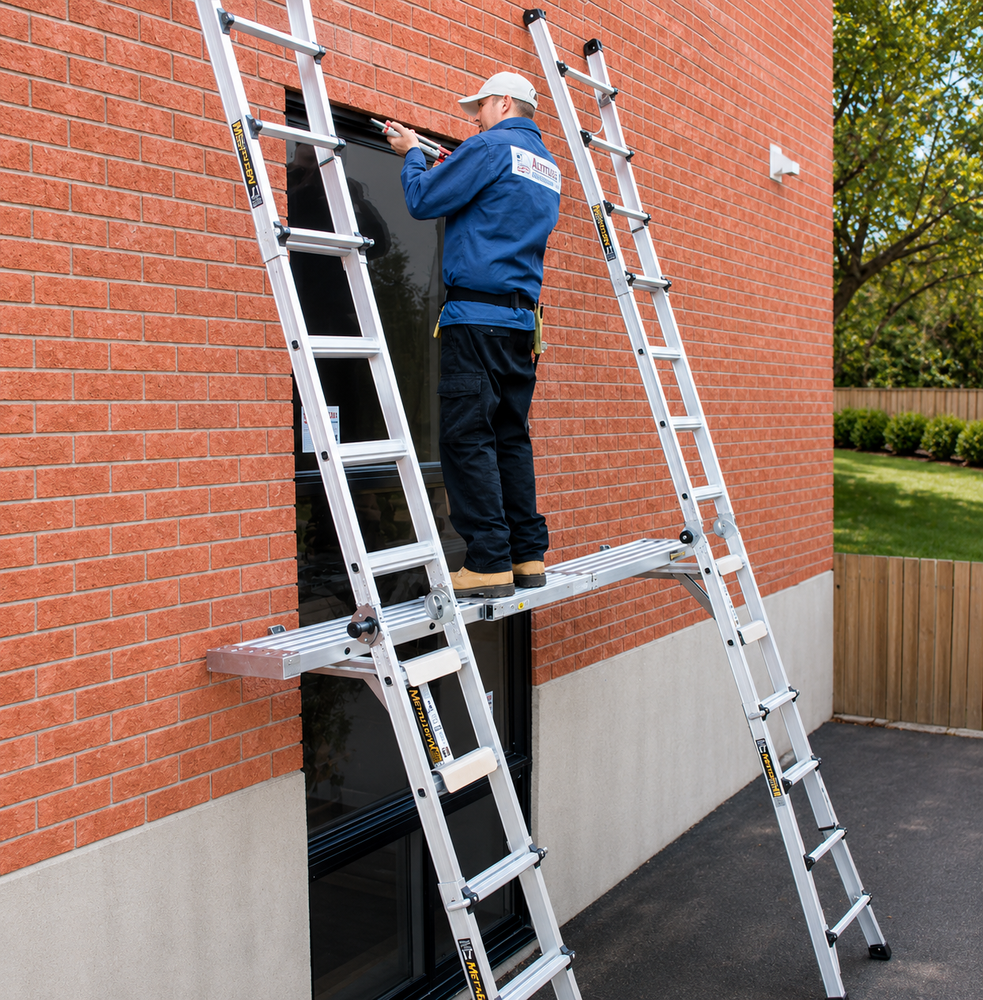

# Context-Rich Problem Set

## Commercial Aluminum Ladder-Platform System and Adjustable Support Bracket

### Industry Context

You are a product-development engineer working for a manufacturer of commercial access equipment.

The company is evaluating an elevated work-platform system used by maintenance personnel, painters, inspectors, and construction workers. The system consists of two aluminum extension ladders supporting a horizontal work platform. A worker stands on the platform while carrying tools, equipment, and construction materials.

The product must be portable, lightweight, easy to assemble, compatible with common commercial ladders, stable during use, sufficiently strong and stiff, resistant to repeated loading, and economical to manufacture and maintain.

The system may be used outdoors and may be exposed to uneven ground, wind, rain, corrosion, accidental impact, repeated assembly, improper installation, worker movement, and eccentric loading.

Only product photographs and a preliminary concept are initially available. Detailed load ratings, dimensions, material properties, attachment conditions, allowable deflections, and service-life requirements must be established by the design team.

{fig-alt="Commercial ladder-platform system with two ladders supporting a work platform." width=100%}

### Main Engineering Goal

Determine whether the proposed ladder-platform system can be developed into a safe, stable, and commercially practical product for repeated use in building-maintenance operations.

The assessment must identify the governing operating conditions, complete load path, critical components, material and geometric properties, acceptance criteria, appropriate calculation or simulation methods, a simplified structural idealization, a critical component for detailed analysis, and a final engineering recommendation.

The full system should be considered first. The adjustable support bracket is introduced later as the critical component selected for detailed mechanics analysis.

