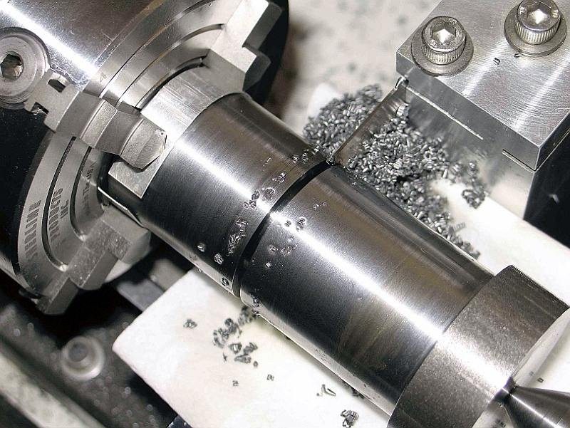

# Context-Rich Solid Mechanics Problem

## Lathe Parting Tool - Lead-Angle Lateral Deflection and Cut Clearance

### Engineering Context

In a lathe parting-off operation, a narrow insert forms a groove wider than the supporting blade body. A lead-angle cutting edge produces an axial cutting-force component that acts laterally on the thin blade. The unsupported blade segment can therefore deflect sideways toward a groove wall.

{fig-alt="Lathe parting tool cutting radially into a rotating cylindrical workpiece." width=72%}

*Instructor-supplied context photograph. Do not infer blade dimensions, unsupported length, force, or an exact commercial tool identity from it.*

### Main Engineering Goal

Model the effective unsupported blade segment as a rectangular cantilever under the given physically based lateral cutting-force component. Determine the lateral tip deflection and decide whether it remains within the nominal one-side cut clearance.

### Analysis Scope

The model uses static linear-elastic weak-axis bending, a rigid holder, a concentrated lateral force, and a centered-cut clearance assumption. It does not claim that the complete commercial tool is literally a bare cantilever or that the static clearance check proves chatter-free operation, full machining stability, or freedom from all rubbing.
