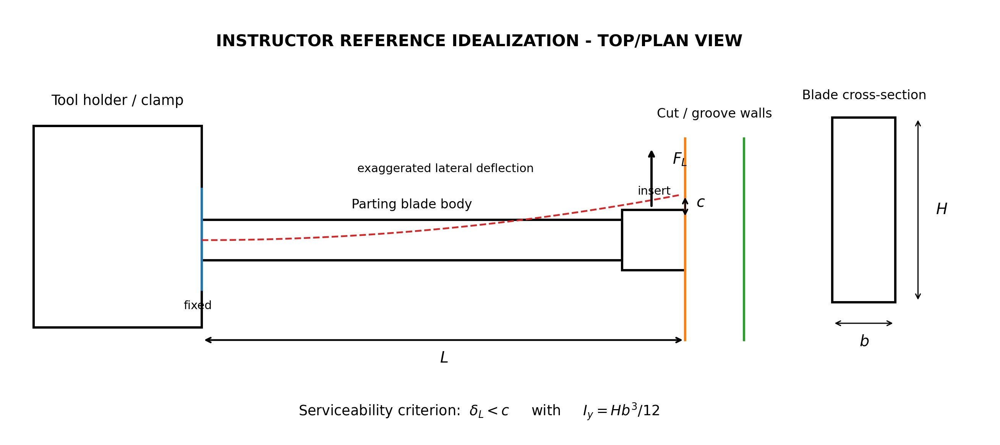

# Purpose

Award credit for connecting the lead-angle lateral force to weak-axis blade bending, constructing the effective cantilever model, calculating clearance and deflection, making a dynamic no-contact assessment, and clearly bounding the limitations of the static model.

# Problem Context



# Instructor Reference Idealization

{fig-alt="Instructor-only top-view cantilever idealization of lateral parting-blade deflection." width=96%}

*The dotted red curve represents an exaggerated deflected shape, not slope. The lateral tip displacement is delta_L.*

# Generated Question Set and Solutions

```{=html}
<div id="lathe-parting-instructor-questions"></div>
<script src="../../data/problem-catalog.js"></script><script src="../../scripts/packet-renderer.js"></script>
<script>document.addEventListener("DOMContentLoaded",()=>window.renderProblemPacket({slug:"lathe-parting-tool-lateral-deflection",targetId:"lathe-parting-instructor-questions",type:"instructor"}));</script>
```

# Force Basis and Provenance

The student is given F_L = 57 N. Instructor-side provenance uses chi = 6 degrees, k_c1.1 = 1700 N/mm^2, m_c = 0.25, s = 3.0 mm, and f = 0.10 mm/rev: F_T = k_c1.1 s f^(1-m_c) = 906.9 N, F_R approximately 0.6F_T = 544.2 N, and F_L = F_R tan(chi) = 57.2 N, rounded to 57 N. This is a physically based engineering estimate, not a manufacturer-rated or directly measured force.

The blade geometry and T_max follow the selected Walter product data described in the faculty package. D = 60 mm, L = 30 mm, E = 210 GPa, the equivalent cantilever, and the centered-clearance assumption are teaching/modeling inputs. L is the effective unsupported segment, not total blade length. Industry-image source/license attribution remains pending confirmation before public release.

# Scope

The calculation excludes time-varying forces, chatter, holder and insert-seat compliance, thermal effects, wear, chip interaction, nonlinear contact after touching a wall, detailed 3D cutting mechanics, and manufacturer operating approval. The deflected-shape curve in the schematic is not a slope diagram.
