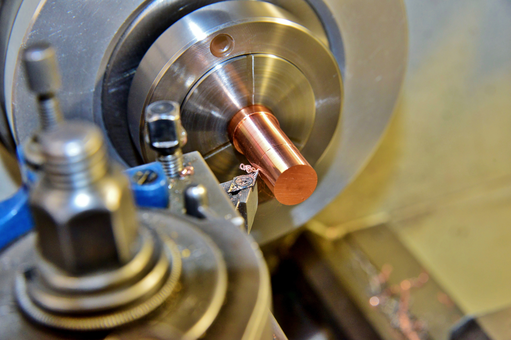

# Context-Rich Solid Mechanics Problem

## Lathe Turning — Cutting-Tool Deflection and Machining Tolerance

### Engineering Context

A machinist is performing an external turning operation on an Al 6061 cylindrical workpiece. Experimental machining conditions supply the radial depth of cut, feed, and passive/radial cutting force. Because the cutting tool projects from its clamp, the radial force elastically bends the tool-holder shank. Even a small cutting-edge displacement can produce a measurable finished-diameter error.

{fig-alt="Close view of a lathe turning operation with a cutting insert contacting a rotating cylindrical workpiece." width=88%}

::: {.callout-note title="Industry image source"}
“Lathe, Metal Processing, Machine” by Ralphs_Fotos, via [Pixabay](https://pixabay.com/photos/lathe-metal-processing-machine-4021097/), image #4021097. Used under the [Pixabay Content License](https://pixabay.com/service/license-summary/). This is a representative turning photograph, not the experimental setup used by Ojal et al. (2022).
:::

### Main Engineering Goal

Determine whether elastic radial deflection of the idealized tool holder is small enough to maintain the assigned finished-diameter tolerance, and determine the maximum allowable tool overhang for that serviceability limit.

### System Components

- rotating Al 6061 workpiece being turned to the specified diameter;
- single-point cutting insert contacting and removing workpiece material;
- square-shank steel tool holder transferring the radial cutting load;
- tool post and clamping region providing the idealized fixed restraint; and
- cutting edge whose radial displacement contributes to diameter error.

### Assigned Scope

Only elastic radial bending of the idealized tool-holder shank is evaluated. The passive force is taken to deflect the cutting edge away from the workpiece, reducing the achieved radial depth of cut and producing an oversized diameter. The result is one contribution to machining error, not a prediction of total real-machine accuracy.
