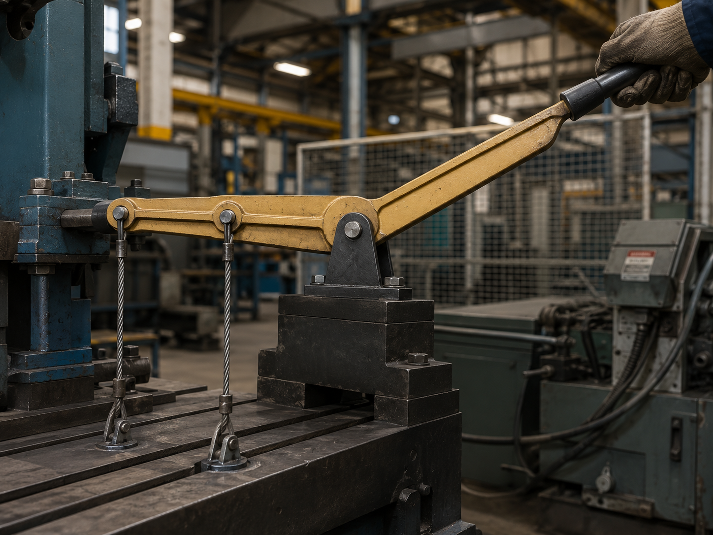

# Context-Rich Solid Mechanics Problem

## Lever-Actuated Wire Support Mechanism

### Engineering Context

A manufacturing engineering team is evaluating a hand-operated lever used in a clamping or tensioning fixture. The rigid lever is mounted at a pivot and restrained by two vertical steel wires connected to fixed lower anchors.

When an operator applies a force at the handle, the lever rotates and stretches both wires. Because the wires are located at different distances from the pivot, they develop unequal elongations and forces. The A-36 steel wires are modeled as elastic-perfectly plastic, so yielding must be checked explicitly.

{fig-alt="Hand-operated rigid lever connected to two vertical steel wires in an industrial fixture." width=86%}

### Main Engineering Goal

Determine the final force and elongation in each wire under the applied handle load, and identify whether each wire remains elastic or yields.

### System Components

- rigid lever arm and handle;
- frictionless pivot support at E;
- vertical steel wire AB;
- vertical steel wire CD;
- fixed lower anchors at B and D.
