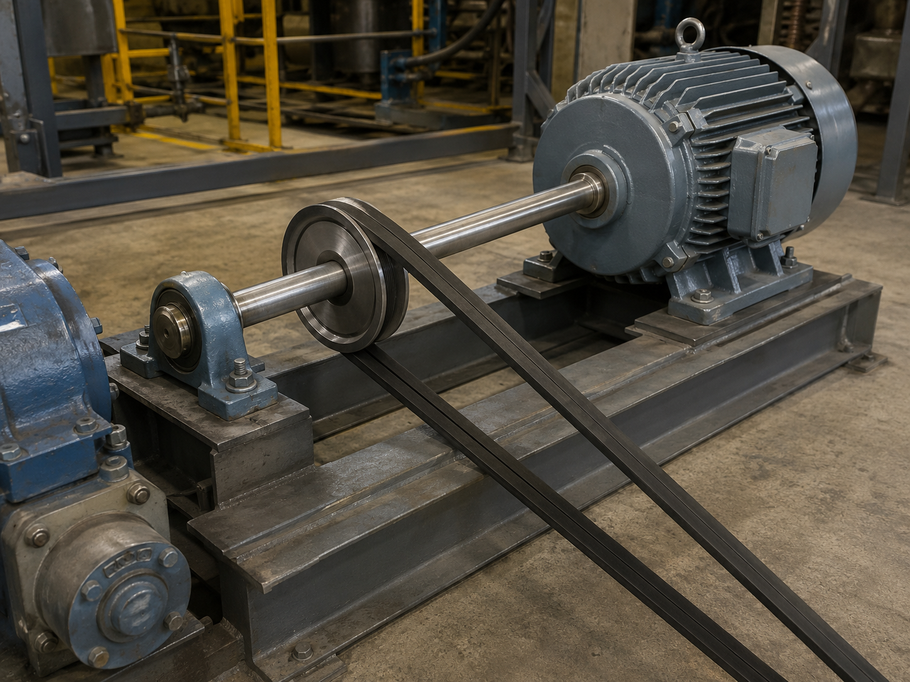

# Context-Rich Solid Mechanics Problem

## Motor-Driven Shaft Design for a Belt-Transmission System

### Engineering Context

A manufacturing facility is upgrading a belt-driven conveyor subsystem. An electric motor delivers power to a solid steel shaft, and the shaft transmits torque to a pulley that drives downstream equipment.

The shaft must carry the operating torque without exceeding the allowable torsional shear stress. Because shafts are purchased in standard fractional-inch sizes, the design must determine the theoretical minimum diameter, round upward to an available size, and verify the selected shaft.

{fig-alt="Industrial electric motor driving a belt pulley through a supported steel shaft." width=88%}

### Main Engineering Goal

Determine the minimum safe diameter of the solid steel shaft, select the next available standard size, verify its torsional stress, and check its angle of twist.

### System Components

- electric motor and motor-side coupling at A;
- solid circular steel shaft AB;
- pulley and belt set;
- rotation-permitting bearing support at B;
- downstream driven equipment.
