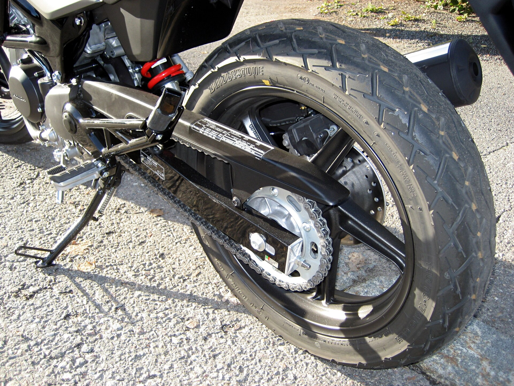

# Context-Rich Solid Mechanics Problem

## Motorcycle Final Drive — Chain Loading and Rear-Axle Bending

### Engineering Context

A roller chain transfers power from a motorcycle gearbox/front sprocket to the rear sprocket and wheel. During steady driving, the tight-side chain tension exceeds the slack-side tension. The tension difference generates rear-sprocket torque, while the approximately parallel chain tensions together apply a transverse load to the rear-wheel and sprocket assembly.

{fig-alt="Photograph of a motorcycle rear final-drive assembly showing the chain, rear sprocket, rear wheel, swingarm, and axle region." width=88%}

*Image attribution: “Honda VTR250 2009 Sprocket.JPG,” Khaosaming, Wikimedia Commons, [CC BY-SA 3.0](https://creativecommons.org/licenses/by-sa/3.0/). The photograph establishes context only. Assigned loads, dimensions, and material values are representative teaching/design inputs, not Honda VTR250 specifications.*

For this problem, the real wheel, sprocket carrier, bearings, axle, and swingarm are reduced to an equivalent planar model. The axle is treated as a simply supported solid circular beam, and the chain-induced transverse demand is represented by a concentrated load at the sprocket plane. Wheel/rider weight, road and tire forces, braking, cornering, suspension action, impact, and fatigue are outside the base problem.

The equivalent axle is assigned normalized AISI 4140 steel with a yield strength of 485 MPa. This is a published representative yield strength for normalized AISI 4140 steel and an instructor-assigned teaching value; it is not a claim about the actual axle material of the motorcycle shown.

### Main Engineering Goal

Determine whether the idealized rear axle satisfies the required first-yield factor of safety under the specified steady chain-drive loading, and determine the minimum equivalent axle diameter permitted by the assigned strength criterion.

### System Components

- front sprocket and gearbox output, which supply drive torque;
- tight-side and slack-side chain runs, which transmit tensile force;
- rear sprocket and wheel carrier, which transfer torque to the wheel;
- wheel bearings and rear axle, represented by an equivalent transverse-load path; and
- swingarm sides, represented by the two simple axle supports.
