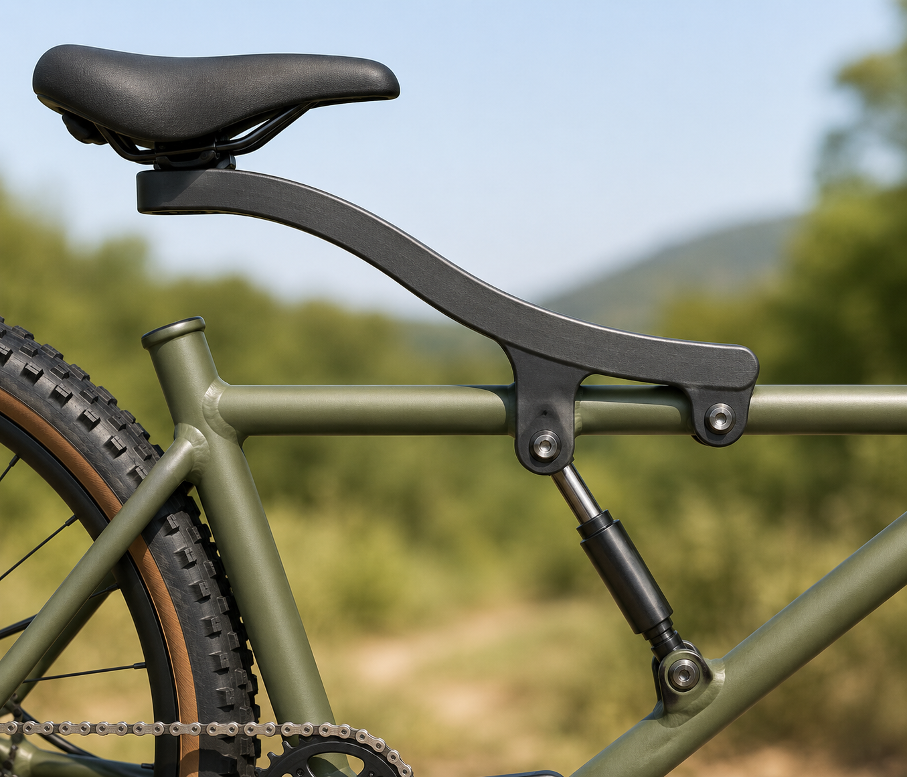

# Context-Rich Solid Mechanics Problem

## Mountain Bike Rear Suspension Linkage: Pin Shear and Factor of Safety

### Engineering Context

A mountain-bike or lightweight e-bike product team is reviewing the rear suspension linkage that supports rider load through a seat support member and shock absorber linkage. During riding, a vertical load from the rider is transmitted through the saddle into a curved support member, then into frame-mounted pins and the shock/link assembly.

As a junior mechanical engineer, you must simplify the real suspension assembly into a mechanics model and determine whether the pins at B and C have adequate resistance against shear failure under the specified design load.

The analysis is limited to static equilibrium and average double-shear stress in the pins. Detailed dynamic loading, fatigue, bearing pressure, bushing wear, shock nonlinearities, and frame deformation are outside the base problem.

{fig-alt="Mountain bike rear suspension and seat support linkage in an outdoor context." width=100%}

### Main Engineering Goal

Determine the forces transmitted through the suspension linkage and evaluate the factor of safety of pins B and C against shear failure. Identify the governing pin and make a limited mechanics-based recommendation for the specified static load case.

### System Components

- saddle or rider contact location;
- curved seat support or suspension member;
- frame pin at C;
- shock/link attachment pin at B;
- shock absorber or two-force link BD;
- lower frame joint at D;
- bicycle frame.
