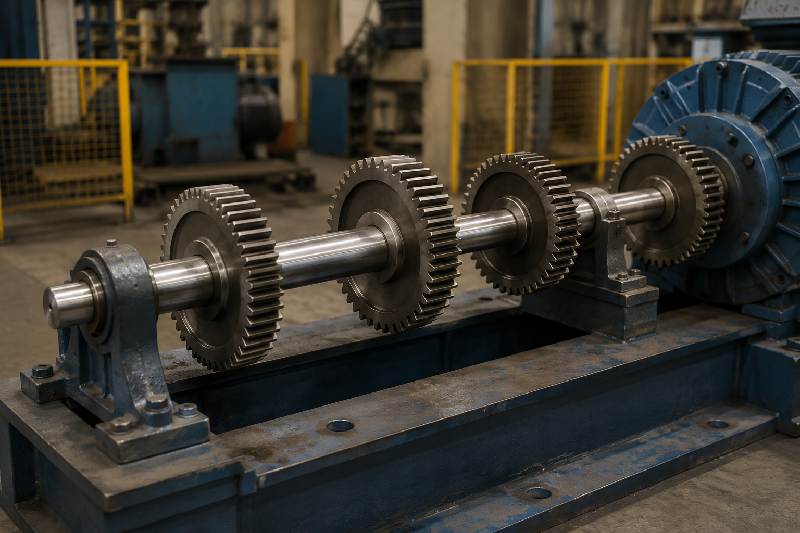

# Context-Rich Solid Mechanics Problem

## Torque Distribution and Hollow-Shaft Sizing for a Multi-Gear Drive Shaft

### Engineering Context

A manufacturing line uses a common rotating shaft to distribute mechanical power among several processing stations. Each gear either introduces torque into the shaft or removes torque to drive a station, so the internal torque is not uniform along the shaft.

The maintenance and design team is evaluating the existing solid shaft and considering a tubular replacement with the same outer diameter. The replacement should reduce rotating mass while satisfying the assigned allowable torsional shear stress.

{fig-alt="Industrial line shaft carrying several gears between bearing supports and a drive unit." width=88%}

### Main Engineering Goal

Determine the signed internal torque and maximum torsional shear stress in each shaft segment, identify the governing segment, and select and verify the minimum available tubular wall thickness.

### System Components

- common circular steel drive shaft;
- gears at B, C, D, and F;
- rotation-permitting bearings at A and E;
- driver and driven production machinery;
- supporting machine frame and bedplate.
