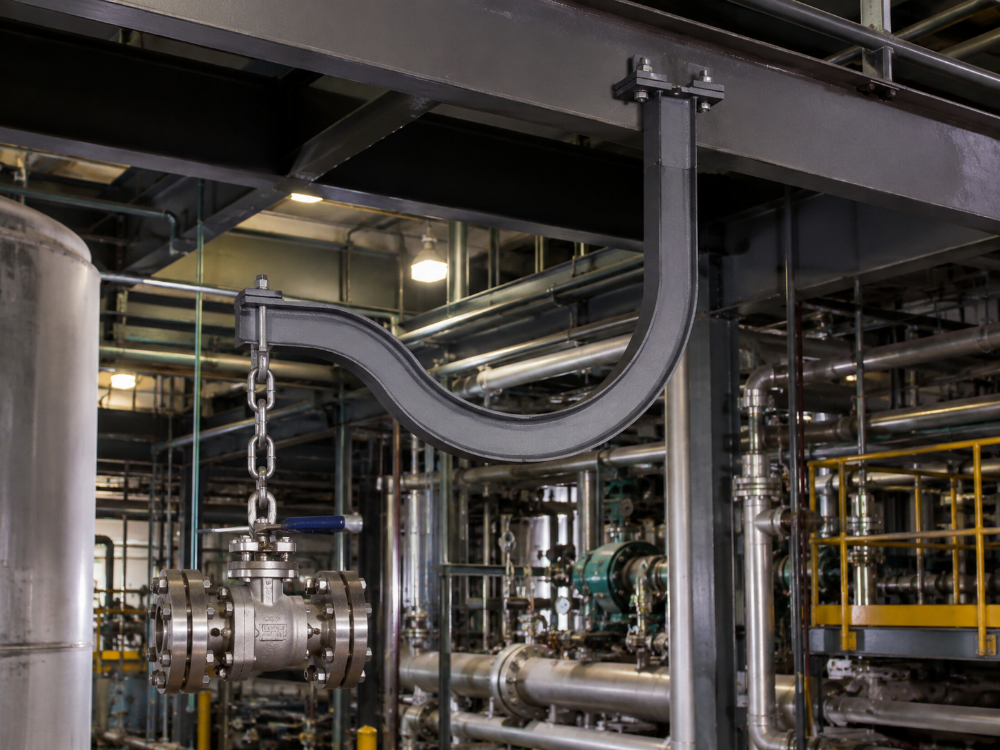

# Context-Rich Solid Mechanics Problem

## Allowable Load for an Offset Overhead Process-Equipment Hanger

### Engineering Context

A process plant uses an offset steel hanger to support a suspended valve, tooling fixture, or maintenance component from an overhead beam. The curved geometry shifts the chain attachment away from the support so the suspended equipment clears nearby piping, vessels, and access space. That useful clearance also creates a substantial bending moment in the lower portion of the hanger.

The engineering team has identified section a-a as the critical section for the base review. The assigned criterion limits flexural normal stress under simplified static loading. Chain design, local connection behavior, fatigue, impact, and stress concentrations are outside the base analysis.

{fig-alt="Industrial offset hanger transferring a suspended process-equipment load to an overhead structural beam." width=88%}

### Main Engineering Goal

Determine the maximum allowable suspended load at E such that the largest bending-stress magnitude at section a-a does not exceed the specified allowable stress. Identify the governing extreme fiber and explain how section geometry or load offset could be changed to increase capacity.

### System Components

- suspended valve, fixture, or maintenance component;
- chain and attachment point E;
- curved offset steel hanger;
- critical section a-a;
- fixed overhead connection at D; and
- overhead structural beam carrying the reactions.
