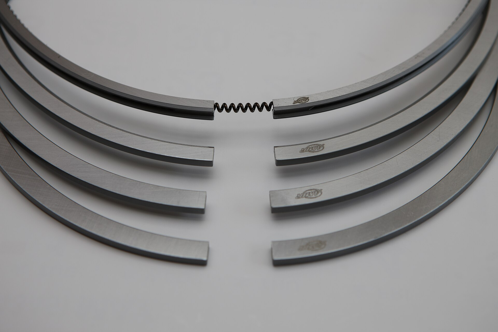

# Context-Rich Solid Mechanics Problem

## Piston Ring — Elastic Closure and Cylinder-Wall Contact Pressure

### Engineering Context

Compression piston rings are manufactured as split elastic rings with a free gap. During engine assembly, a ring is compressed and inserted into a cylinder bore. The bore restrains the ring at a smaller installed gap, so elastic recovery develops outward contact with the cylinder wall. Ring geometry, manufactured free shape, stiffness, and specified tangential closing force are therefore connected to sealing behavior.

{fig-alt="Several metallic compression piston rings arranged to show their split ends and free gaps." width=88%}

::: {.callout-note title="Industry image source"}
“AMIR-PISTON RING-3.JPG” by Jaeyoungchoi77, via [Wikimedia Commons](https://commons.wikimedia.org/wiki/File:AMIR-PISTON_RING-3.JPG), licensed under [CC BY-SA 3.0](https://creativecommons.org/licenses/by-sa/3.0/). The photograph is representative; its rings are not claimed to have the assigned dimensions or force.
:::

### Main Engineering Goal

Determine the ring's free-to-installed gap closure, rectangular-section properties, mean/equivalent cylinder-wall pressure, and equivalent total normal contact force. Then explain how the result relates to sealing and why the simplified mean-pressure model does not reproduce the complete local contact response of a real piston ring.

### System Components

- split cast-iron compression ring that elastically closes during installation;
- cylinder bore that imposes the nominal installed circular geometry and supplies distributed contact reaction;
- ring end gap that changes from free gap *m* to installed gap *s*; and
- piston/ring groove that locates the ring in service but is excluded from the detailed model.

### Assigned Scope

Use the specified tangential closing force *F*~t~ for the installed condition. Do not derive it from *m* − *s* with a straight-beam or cantilever equation: real piston-ring closure is a curved-member/contact problem. The calculation gives a mean/equivalent wall pressure, not an exact uniform local pressure.
