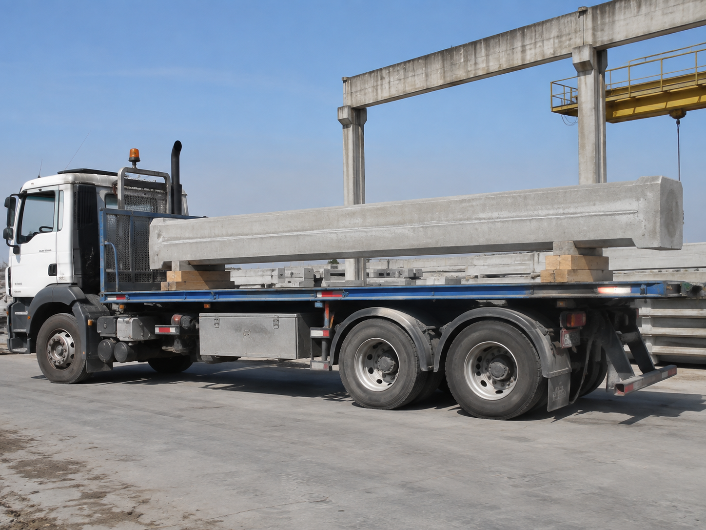

# Context-Rich Solid Mechanics Problem

## Optimal Support Placement for Transporting a Precast Concrete Column

### Engineering Context

A precast-concrete manufacturer must transport a long, uniform column from the casting yard to a construction site. Two timber or elastomeric support blocks carry the member on a flatbed trailer. Support placement matters because the continuously distributed self-weight can create transport-induced bending and cracking.

The transportation engineering team must choose equal support offsets from the column ends. The static beam model should reduce the largest absolute bending moment without redesigning the truck or the column.

{fig-alt="Long precast concrete column supported at two locations on a flatbed truck in a casting yard." width=88%}

### Main Engineering Goal

Determine the equal support offset that minimizes the absolute maximum bending moment, construct the corresponding shear-force and bending-moment diagrams, and identify the governing positive and negative moment locations.

### System Components

- uniform precast concrete column;
- front and rear transport support blocks;
- equal column end overhangs;
- flatbed trailer, truck suspension, and axles;
- road support.
