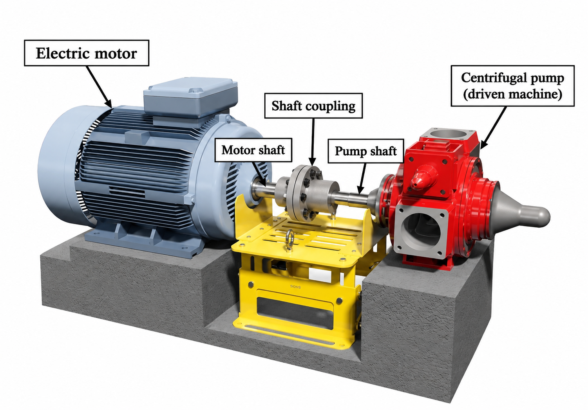

# Context-Rich Solid Mechanics Problem

## Torsional Stress in a Pump Drive Shaft Connected by a Shaft Coupling

### Engineering Context

An electric motor drives a centrifugal pump through aligned shafts connected by a shaft coupling. During steady operation, the motor supplies mechanical power and driving torque. The coupling transfers that torque to the pump shaft, where the driven machine supplies an equal and opposite resisting torque.

You are a mechanical engineer evaluating whether the solid circular motor shaft can transmit the required torque without exceeding its specified allowable torsional shear stress.

{fig-alt="Labeled motor-pump installation showing the electric motor, motor shaft, shaft coupling, pump shaft, and centrifugal pump." width=88%}

### Main Engineering Goal

Determine the transmitted torque, evaluate the maximum torsional shear stress at the motor-side critical shaft section, and determine the minimum acceptable solid-shaft diameter for the assigned allowable stress.

### System Components

- electric motor that supplies mechanical power and driving torque;
- solid circular motor shaft containing the critical section;
- shaft coupling that transfers torque without slip;
- pump shaft that receives the transmitted torque; and
- centrifugal pump that supplies the resisting torque during steady operation.

### Scope of the Model

Use a steady-state, one-dimensional torsion model. Assume aligned solid circular shafts, a uniform motor-shaft diameter at the analyzed section, linear-elastic torsion, and no coupling slip. Neglect bending, axial loading, stress concentrations, fatigue, startup transients, and internal coupling stresses.
