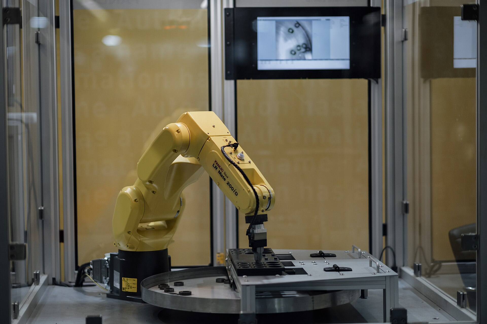

# Context-Rich Solid Mechanics Problem

## Robotic Arm Link - Combined Bending and Torsion

### Engineering Context

Industrial and collaborative robots use structural links to transfer forces and moments between joints while positioning a tool or payload. In this problem, one selected link carries payload-induced bending, its own weight, and a joint/drivetrain torque.

{fig-alt="Yellow industrial robot arm operating inside a guarded laboratory automation cell." width=82%}

*Image: Nenad Stojković (Shixart1985), “Robot arm works on a small component in a lab setting,” Wikimedia Commons, CC BY 2.0. Visual context only; no numerical input is inferred from the photograph.*

### Main Engineering Goal

Determine the root bending stress, torsional shear stress, combined von Mises stress, and static-yield factor of safety of an equivalent Al 6061-T6 robot-arm link. Identify the critical section and dominant stress contribution, then make a limited mechanics-based recommendation.

### Analysis Scope

Model the selected link as a straight, uniform, hollow circular cantilever fixed at its upstream joint. Represent the payload as a concentrated vertical force at the free end, the link self-weight as a resultant at midspan, and the applied moment as pure torque about the longitudinal axis. The equivalent outer diameter is a modeling dimension derived from documented link mass, length, wall thickness, and aluminum density; it is not measured from the photograph or reported directly by the research paper. Assume homogeneous, isotropic material behavior, static loading, and small deformation. Exclude stress concentrations, sensor details, joint compliance, dynamic/inertial loading, impact, fatigue, buckling, connector mechanics, and FEA.
