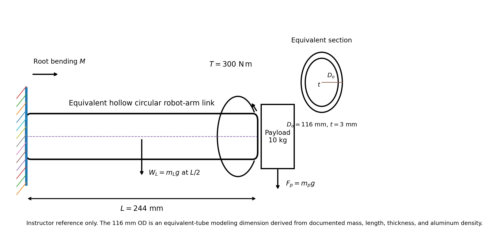

# Purpose

Award credit for tracing payload and torque through the selected link, identifying the fixed root as critical, calculating hollow-section properties and combined stress, applying the von Mises criterion, interpreting the static-yield margin, and bounding the conclusion to the equivalent elementary model.

# Problem Context



# Instructor Reference Idealization

{fig-alt="Instructor-only cantilever model of the robot link and equivalent hollow circular cross-section." width=94%}

The critical section is the fixed root. The payload and link self-weight produce root bending; the joint/drivetrain moment produces torque about the link axis. The section model uses (D_i=D_o-2t), (I=\pi(D_o^4-D_i^4)/64), and (J=\pi(D_o^4-D_i^4)/32).

# Generated Question Set and Solutions

```{=html}
<div id="robotic-arm-link-combined-bending-torsion-instructor-questions"></div>
<script src="../../data/problem-catalog.js"></script><script src="../../scripts/packet-renderer.js"></script>
<script>document.addEventListener("DOMContentLoaded",()=>window.renderProblemPacket({slug:"robotic-arm-link-combined-bending-torsion",targetId:"robotic-arm-link-combined-bending-torsion-instructor-questions",type:"instructor"}));</script>
```

# Value Basis and Provenance

- Yun, A.; Lee, W.; Kim, S.; Kim, J.-H.; Yoon, H. (2022), “Development of a Robot Arm Link System Embedded with a Three-Axis Sensor with a Simple Structure Capable of Excellent External Collision Detection,” *Sensors* 22(3), 1222, DOI: 10.3390/s22031222. The study documents the 244 mm length, 3 mm thickness, fully fixed boundary, 0.700 kg link mass, 10 kg payload case, 300 N·m applied moment, Al 6061-T6 material, and 240 MPa yield stress.
- The accessible paper text does not report a numerical outer diameter. The equivalent uniform-tube relation (m=\rho(\pi/4)[D_o^2-(D_o-2t)^2]L), using 2700 kg/m³ aluminum density, gives (D_o\approx115.739\) mm. The assigned 116 mm value is a derived teaching-model dimension, not a photograph measurement or claimed paper/manufacturer diameter.
- The industry photograph is by Nenad Stojković (Shixart1985), Wikimedia Commons, CC BY 2.0, and contributes no numerical input.

# Published Detailed-Model Context

The source study reports maximum principal stresses of approximately 5.30 MPa for the 10 kg payload case, 15.15 MPa for the 300 N·m torsional-moment case, and 18.19 MPa for the combined case. These instructor-context values are not target answers for the equivalent-tube calculation because the published geometry, sensor features, and stress field are more detailed.

# Scope and Model Limitations

The equivalent tube does not reproduce local sensor-link geometry, strain-gauge attachment details, stress concentrations, joint interfaces, drivetrain compliance, or real industrial-robot castings and covers. The photograph is not the published research specimen. The result is a static elementary strength assessment, not fatigue, impact, dynamics, buckling, connector, sensor, compliance, certification, or FEA analysis.
