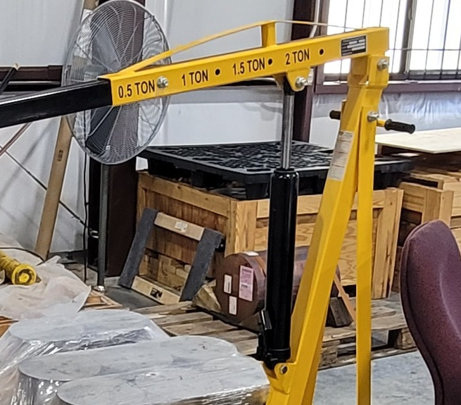

# Context-Rich Solid Mechanics Problem

## Shop Crane Pin/Bolt Connection - Shear and Bearing

### Engineering Context

This problem examines only the **large upper boom-to-mast pivot pin**, where the adjustable boom rotates relative to the mast/upright assembly. The smaller lower hydraulic-ram pin and all other crane fasteners are outside the problem scope.

{fig-alt="Yellow portable shop crane showing its upper boom-to-mast pivot region, mast, boom, and hydraulic ram." width=78%}

*Professor-supplied context photograph. Do not infer pin diameter, plate thickness, force, material properties, allowables, or an exact crane model from it.*

### Main Engineering Goal

Model the selected upper pivot as an equivalent symmetric double-shear clevis, evaluate average pin shear and projected plate bearing stresses, compare them with assigned teaching allowables, and identify the governing included check.

### Analysis Scope

Use static equivalent loading, symmetric F/2 sharing between the two outer plates, average stress distributions, and instructor-assigned geometry and allowables. Exclude the smaller ram pin, pin bending, detailed contact pressure, tear-out, net-section tension, plate bending, preload/friction, clearance, welds, fatigue, impact, dynamics, wear, boom bending, mast buckling, hydraulics, full-crane equilibrium, tipping, FEA, and certification.
