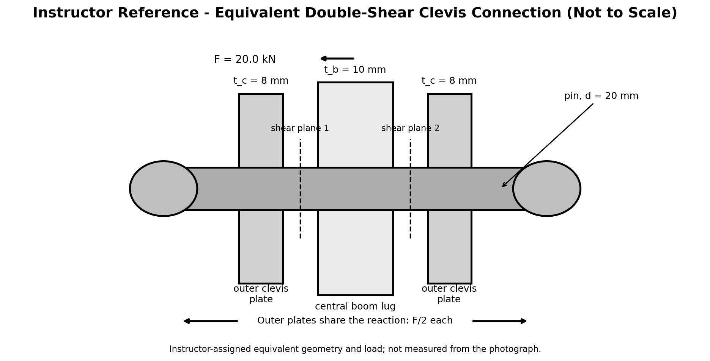

# Purpose

Award credit for selecting the large upper boom-to-mast pivot, constructing the symmetric double-shear clevis model, distinguishing pin shear from plate bearing, applying the F/2 outer-plate split, comparing assigned allowables, and making a bounded connection recommendation.

# Problem Context



# Instructor Reference Idealization

{fig-alt="Instructor-only equivalent symmetric double-shear clevis reference." width=96%}

# Generated Question Set and Solutions

```{=html}
<div id="shop-crane-pin-instructor-questions"></div>
<script src="../../data/problem-catalog.js"></script><script src="../../scripts/packet-renderer.js"></script>
<script>document.addEventListener("DOMContentLoaded",()=>window.renderProblemPacket({slug:"shop-crane-pin-connection-shear-bearing",targetId:"shop-crane-pin-instructor-questions",type:"instructor"}));</script>
```

# Sources and Provenance

F is an instructor-assigned equivalent local pivot force, not a measured or derived actual force and not asserted equal to the hook load. Pin diameter d and plate thicknesses t_b and t_c are instructor-assigned teaching dimensions, not photograph measurements. The shear and bearing allowables are instructor-specified comparison criteria, not manufacturer or identified-material properties.

# Scope

The included average-stress checks do not establish the actual crane failure mode or factor of safety. Pin bending, nonuniform contact pressure, tear-out, net-section tension, edge distance, plate bending, local yielding beyond the teaching comparison, preload/friction, clearance, hole ovalization, welds, fatigue, impact, dynamics, wear, frame interaction, boom bending, mast buckling, hydraulics, full-crane equilibrium, tipping, and certification are excluded.
