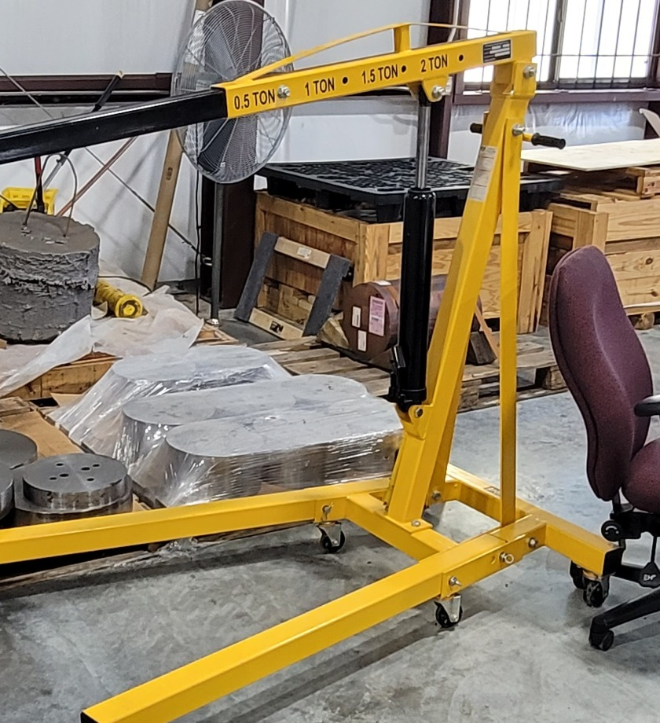

# Context-Rich Solid Mechanics Problem

## Shop Crane Vertical Mast - Column Buckling

### Engineering Context

A portable shop crane transfers lifting demand through its hook, adjustable boom, hydraulic system, vertical mast, diagonal braces, connections, base, and floor. The real mast is part of a **braced frame** and is not literally an isolated pinned-pinned column.

{fig-alt="Yellow portable shop crane with its vertical mast, diagonal bracing, boom, hydraulic ram, and base visible." width=78%}

*Professor-supplied context photograph. Do not identify an exact commercial model or infer dimensions, material properties, end restraint, or mast force from it.*

### Main Engineering Goal

Replace the real mast/frame interaction with the assigned equivalent column model, identify the weak buckling axis, calculate the idealized Euler critical load and load ratio, and assess the limits of applying that model to the real crane.

### Analysis Scope

Use an instructor-assigned equivalent axial load, straight prismatic rectangular hollow section, linear-elastic Euler column idealization, and equivalent effective-length factor. Exclude boom bending, pin/bolt mechanics, hydraulic-force analysis, complete-frame analysis, tipping, axial-yield FOS, inelastic-column design, local plate-buckling design, fatigue, impact, vibration, FEA, certification, and manufacturer-capacity verification.
