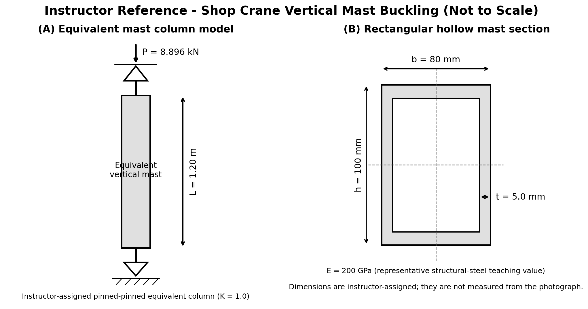

# Purpose

Award credit for distinguishing the braced real frame from the equivalent column, tracing the load path, calculating both centroidal inertias, selecting the weak axis, evaluating radius of gyration and slenderness, applying Euler buckling, and interpreting the result without claiming a real-crane factor of safety.

# Problem Context



# Instructor Reference Idealization

{fig-alt="Instructor-only equivalent mast column and rectangular hollow-section reference." width=96%}

# Generated Question Set and Solutions

```{=html}
<div id="shop-crane-vertical-mast-buckling-instructor-questions"></div>
<script src="../../data/problem-catalog.js"></script><script src="../../scripts/packet-renderer.js"></script>
<script>document.addEventListener("DOMContentLoaded",()=>window.renderProblemPacket({slug:"shop-crane-vertical-mast-buckling",targetId:"shop-crane-vertical-mast-buckling-instructor-questions",type:"instructor"}));</script>
```

# Sources and Provenance

The 8.896 kN value is an instructor-defined equivalent axial mast load, numerically corresponding approximately to 2000 lbf and the nominal 1-ton teaching load used in this crane series. It is not a measured or derived actual mast force. The modeled length and section dimensions are instructor-assigned and are not measured from the photograph. The 200 GPa modulus is a representative structural-steel teaching value; no steel grade is identified. The pinned-pinned condition and K = 1.0 are equivalent teaching assumptions, not claims about the real crane restraints.

ATD Tools' ATD-10141B product information and ATD-10141 family manual provide only general commercial context and component vocabulary. They do not identify the photographed crane or provide this model's inputs: <https://www.atdtools.com/10141> and <https://atdtools.com/PDF/ATD10141_rev_0417.pdf>.

# Scope and Euler-Model Limitation

The real mast is part of a braced frame. The calculated KL/r is approximately 38, so the classical Euler result must not be presented as a validated physical failure load for the real steel mast. Real restraint, bracing, frame interaction, eccentricity, imperfections, residual stress, yielding or inelastic behavior, local wall buckling, connections, hydraulic/boom interaction, and dynamic effects are excluded. The reported load ratio is an idealized Euler buckling margin, not the crane's actual factor of safety or certification.
